# **摘要**

随着信息高速公路的建立，Internet的普及，网络技术的迅猛发展，人类社会已经进入了一个信息化社会。

对于信息的高效管理，不必言喻其重要性，随着信息量的增长，可重复利用和效率尤为重要，作品以基本信息为模型，因种种原因，涉及的范围小而冷。

本毕业设计的内容是设计并且实现一个基于*web*技术的信息管理系统。系统的IDE为： “IntelliJ IDEA” ，主要以Spring、SpringMVC、MyBatis、JavaScript等构成。实现了对于部门及员工的信息进行查询、修改、删除及增加的功能。

关键词：信息管理、数据库、JavaEE、Linux

# **ABSTRACT**

With the establishment of information superhighway, the popularization of Internet and the rapid development of network technology, human society has entered the information society.

In order to manage information effectively, there is no need to describe its importance. With the growth of information, reusability and efficiency are particularly important. This work takes the basic information as the model. Due to various reasons, the scope involved is very small and cold.

The content of this graduation project is to design and implement an information management system based on Web technology. The ide of the system is "IntelliJ idea", which is mainly composed of spring, spring MVC, mybatis and JavaScript. It realizes the functions of querying, modifying, deleting and adding department and employee information.

Key words: information management, database, Java EE, Linux

# 目录

[TOC]


# 引言

随着科学技术的不断提高,计算机科学日渐成熟,网上银行的迅速发展，其强大的功能已为人们深刻认识,它已进入人类社会的各个领域并发挥着越来越重要的作用。

作为计算机应用的一部分,使用计算机对家庭财务进行管理,有着手工管理所无法

比拟的优点，如:检索迅速、查找方便、可靠性高、存储量大、保密性好、寿命长、成本低等。这些优点能够极大地提高家庭财务管理的效率,也是家庭理财的科学化、正规化管理,与先进科学技术接轨的重要条件。

《员工信息管理系统》是一款简洁、灵活、可重复利用的Web程序。实现了对于信息的增删改查等基本功能外，以及添加了分页展示的功能，通过Ajax传输json数据。

## 问题的提出

身处于快节奏的世纪中，对于信息的可重复利用变的尤为重要，减少工作的繁杂，增加可重复利用资源，减少信息而中间传递。

## 课题简介

**Brools法则：向进度落后的项目中增加人手，只会使进度更加落后。** [^1]

人数和时间的互换仅仅适用于每个人的工作相互独立且不需要交流。对于一项工程来说，人员配置是即为重要的。**如果一个程序10个月开发完的系统，10个人干1个月就能完成，那这就是神话。**，如同一个幼儿需要一位妇女怀胎十月，无法通过十位妇女怀胎一个月完成，在此基础上，需要时间的填补。

直观的展示员工的信息，可以更加有利于对于工程的人员分配情况。

员工信息管理系统是企业管理中的一个重要内容，随着时代的进步，企业人员数量也不断增加、分工的不断细化、各个行业间的联系的不断密切，对人事管理的要求也不断提高。如何管理企业内部员工的信息，对员工实施高效的宏观管理，对企事业单位的人员构成情况和发展趋势进行统计、规划、分析并制定切实可行的人事政策，是一项繁重而艰巨的任务。


# 本文结构

制作网站：https://processon.com/

ProcessOn是一款专业在线作图工具和分享社区。它支持流程图、思维导图、原型图、网络拓扑图和UML等多种类型的绘制。

***学生或者老师可以领取相应的会员功能***。


## 服务器

服务器选用阿里云的服务器，镜像为Centos8.2。

CentOS 8是CentOS项目发布的开源类服务器操作系统，于2019年9月24日正式发布。 [2] 

### Linux搭建JavaEE环境

查看Linux的目录结构如下：

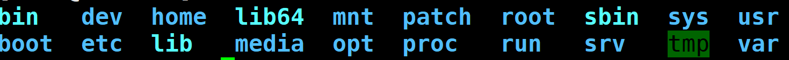

JavaEE[3]将在 /opt 目录搭建，使用工具Xftp将jdk-8u261-linux-x64.tar.gz 传输到/opt/jdk的中。使用tar解压压缩包，将压缩包移动到 /usr/local/java 的目录下

命令：

| 步骤                                                         |
| ------------------------------------------------------------ |
| 1.使用Xshell登录服务器                                       |
| 2.cd /opt ,mkdir jdk                                         |
| 3.通过使用 lscpu 命令查看系统的信息，下载相符的JDK应用程序   |
| 4.使用Xfttp将jdk-8u261-linux-x64.tar.gz 传输到 /opt/jdk 目录中 |
| 5.使用tar 解压压缩包 ： tar -zxvf jdk-8u261-linux-x64.tar.gz |
| 6.在/usr/local/目录下创建文件包 java，将解压的包移动到  mkdir /usr/local/java  mv /opt/jdk/jdk1.8.0_261 /usr/local/java |
| 7.配置环境变量的配置文件 vim /etc/profile                    |
| 8.配置JAVA_HOME :  export JAVA_HOME=/usr/local/java/jdk1.8.0_261 |
| 9.配置path路径： export PATH=$JAVA_HOME/bin:$PATH            |
| 10.让配置的环境变量生效： source /etc/profile                |
|                                                              |
| Tomcat环境配置：[^5]                                         |
| 1.上传文件同Java环境，并解压到 /opt/tomcat 中                |
| 2.开放端口号，firewall-cmd --add-port=8080/tcp --permanent ； 重载添加的端口号：firewall-cmd --reload ； 查询指定端口是否开启成功 firewall-cmd --add-port=8080/tcp[^6] |
| 3.tomcat的默认端口号为：8080，修改端口号，进入解压包中的/conf目录，vim server.xml 文件 |
| 4.进入解压包中，进入 bin 目录，启动  tomcat  服务的命令为： ./startup.sh |
| 5.关闭命令在 ./shutdown.sh                                   |

测试Tomcat是否运行正常，访问8080端口，正常如下图所示。

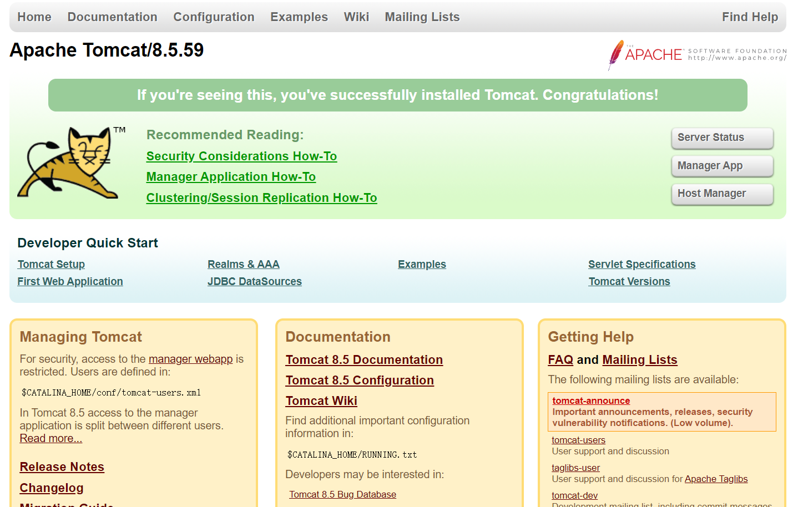

### 数据库搭建

服务器管理使用宝塔面板。

https://www.bt.cn/new/index.html

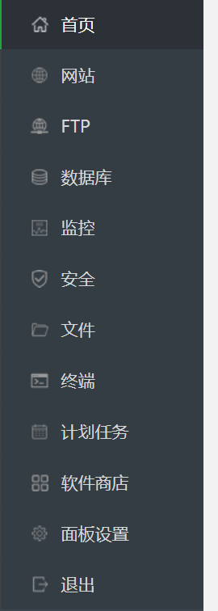

宝塔面板的功能详情。

通过 **软件商店** 按钮，进入面板，搜索MySQL[4]，进行安装。

通过Xshell远程连接服务器。进入MySQL数据库。`mysql -u用户名 -p`，登录数据库，source (sql文件的所在路径全名)。

## 服务开发

在Windows系统中开发，因为Java语言的特点，一次编译，多出运行，借助maven的打包策略，最后将包部署到服务器中即可。

# 系统应用的关键技术

### 代码管理和版本控制 

版本控制是指对软件开发过程中各种程序代码、配置文件及说明文档等文件变更的管理，是软件配置管理的核心思想之一。[^7]

### git

- GIT（分布式版本控制系统）

- 特点

分布式相比于集中式的最大区别在于开发者可以提交到本地，每个开发者通过克隆（git clone），在本地机器上拷贝一个完整的Git仓库。

如图1所示是经典的git开发过程。

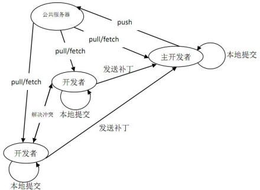

Git的功能特性：

从一般开发者的角度来看，git有以下功能：

1、从服务器上克隆完整的Git仓库（包括代码和版本信息）到单机上。

2、在自己的机器上根据不同的开发目的，创建分支，修改代码。

3、在单机上自己创建的分支上提交代码。

4、在单机上合并分支。

5、把服务器上最新版的代码fetch下来，然后跟自己的主分支合并。

6、生成补丁（patch），把补丁发送给主开发者。

7、看主开发者的反馈，如果主开发者发现两个一般开发者之间有冲突（他们之间可以合作解决的冲突），就会要求他们先解决冲突，然后再由其中一个人提交。如果主开发者可以自己解决，或者没有冲突，就通过。

8、一般开发者之间解决冲突的方法，开发者之间可以使用pull 命令解决冲突，解决完冲突之后再向主开发者提交补丁。

从主开发者的角度（假设主开发者不用开发代码）看，git有以下功能：

1、查看邮件或者通过其它方式查看一般开发者的提交状态。

2、打上补丁，解决冲突（可以自己解决，也可以要求开发者之间解决以后再重新提交，如果是开源项目，还要决定哪些补丁有用，哪些不用）。

3、向公共服务器提交结果，然后通知所有开发人员。

优点：

适合分布式开发，强调个体。

公共服务器压力和数据量都不会太大。

速度快、灵活。

任意两个开发者之间可以很容易的解决冲突。

离线工作。

缺点：

资料少（起码中文资料很少）。

学习周期相对而言比较长。

不符合常规思维。

代码保密性差，一旦开发者把整个库克隆下来就可以完全公开所有代码和版本信息。

- 介绍

Git --- The stupid content tracker, 傻瓜内容跟踪器。Linus Torvalds 是这样给我们介绍 Git 的。

Git 是用于 Linux内核开发的版本控制工具。与常用的版本控制工具 CVS, Subversion 等不同，它采用了分布式版本库的方式，不必服务器端软件支持（wingeddevil注：这得分是用什么样的服务端，使用http协议或者git协议等不太一样。并且在push和pull的时候和服务器端还是有交互的。），使源代码的发布和交流极其方便。 Git 的速度很快，这对于诸如 Linux kernel 这样的大项目来说自然很重要。 Git 最为出色的是它的合并跟踪（merge tracing）能力。

实际上内核开发团队决定开始开发和使用 Git 来作为内核开发的版本控制系统的时候，世界开源社群的反对声音不少，最大的理由是 Git 太艰涩难懂，从 Git 的内部工作机制来说，的确是这样。但是随着开发的深入，Git 的正常使用都由一些友好的脚本命令来执行，使 Git 变得非常好用，即使是用来管理我们自己的开发项目，Git 都是一个友好，有力的工具。现在，越来越多的著名项目采用 Git 来管理项目开发.

作为开源自由原教旨主义项目，Git 没有对版本库的浏览和修改做任何的权限限制。

目前GIT已经可以在windows下使用，主要方法有二：msysgit和Cygwin。Cygwin和Linux使用方法类似，Windows版本的GIT提供了友好的GUI(图形界面)，安装后很快可以上手，不在此做大篇幅介绍。

本文将以 Git 官方文档 Tutorial， core-tutorial 和 Everyday GIT 作为蓝本翻译整理，但是暂时去掉了对 Git 内部工作机制的阐述，力求简明扼要，并加入了作者使用 Git 的过程中的一些心得体会，注意事项，以及更多的例子。建议你最好通过你所使用的 Unix / Linux 发行版的安装包来安装 Git, 你可以在线浏览本文 ，也可以通过下面的命令来得到本文最新的版本库，并且通过后面的学习用 Git 作为工具参加到本文的创作中来。

- 基本使用

以下是实用主义型的Git命令列表，先大致看一下

- `git clone`
- `git config`
- `git branch`
- `git checkout`
- `git status`
- `git add`
- `git commit`
- `git push`
- `git pull`
- `git log`
- `git tag`

接下来，将通过对 我的博客 仓库进行实例操作，讲解如何使用 `Git` 拉取代码到提交代码的整个流程。

- git clone

> “
>
> 从git服务器拉取代码

```
git clone https://github.com/gafish/gafish.github.com.git
```

代码下载完成后在当前文件夹中会有一个 `gafish.github.com` 的目录，通过 `cd gafish.github.com` 命令进入目录。

- git config

> “
>
> 配置开发者用户名和邮箱

```
git config user.name gafish
git config user.email gafish@qqqq.com
```

每次代码提交的时候都会生成一条提交记录，其中会包含当前配置的用户名和邮箱。

- git branch

> “
>
> 创建、重命名、查看、删除项目分支，通过 `Git` 做项目开发时，一般都是在开发分支中进行，开发完成后合并分支到主干。

```
git branch daily/0.0.0
```

创建一个名为 `daily/0.0.0` 的日常开发分支，分支名只要不包括特殊字符即可。

```
git branch -m daily/0.0.0 daily/0.0.1
```

如果觉得之前的分支名不合适，可以为新建的分支重命名，重命名分支名为 `daily/0.0.1`

```
git branch
```

通过不带参数的branch命令可以查看当前项目分支列表

```
git branch -d daily/0.0.1
```

如果分支已经完成使命则可以通过 `-d` 参数将分支删除，这里为了继续下一步操作，暂不执行删除操作

- git checkout

> “
>
> 切换分支

```
git checkout daily/0.0.1
```

切换到 `daily/0.0.1` 分支，后续的操作将在这个分支上进行

- git status

> “
>
> 查看文件变动状态

通过任何你喜欢的编辑器对项目中的 `README.md` 文件做一些改动，保存。

```
git status
```

通过 `git status` 命令可以看到文件当前状态 `Changes not staged for commit:` （*改动文件未提交到暂存区*）

```
On branch daily/0.0.1
Changes not staged for commit:
  (use "git add <file>..." to update what will be committed)
  (use "git checkout -- <file>..." to discard changes in working directory)
    modified:   README.md
no changes added to commit (use "git add" and/or "git commit -a")
```

- git add

> “
>
> 添加文件变动到暂存区

```
git add README.md
```

通过指定文件名 `README.md` 可以将该文件添加到暂存区，如果想添加所有文件可用 `git add .` 命令，这时候可通过 `git status` 看到文件当前状态 `Changes to be committed:` （*文件已提交到暂存区*）

```
On branch daily/0.0.1
Changes to be committed:
  (use "git reset HEAD <file>..." to unstage)
    modified:   README.md
```

- git commit

> “
>
> 提交文件变动到版本库

```
git commit -m '这里写提交原因'
```

通过 `-m` 参数可直接在命令行里输入提交描述文本

- git push

> “
>
> 将本地的代码改动推送到服务器

```
git push origin daily/0.0.1
```

`origin` 指代的是当前的git服务器地址，这行命令的意思是把 `daily/0.0.1` 分支推送到服务器，当看到命令行返回如下字符表示推送成功了。

```
Counting objects: 3, done.
Delta compression using up to 8 threads.
Compressing objects: 100% (2/2), done.
Writing objects: 100% (3/3), 267 bytes | 0 bytes/s, done.
Total 3 (delta 1), reused 0 (delta 0)
remote: Resolving deltas: 100% (1/1), completed with 1 local objects.
To https://github.com/gafish/gafish.github.com.git
 * [new branch]      daily/0.0.1 -> daily/0.0.1
```

现在我们回到Github网站的项目首页，点击 `Branch:master` 下拉按钮，就会看到刚才推送的 `daily/00.1` 分支了

- git pull

> “
>
> 将服务器上的最新代码拉取到本地

```
git pull origin daily/0.0.1
```

如果其它项目成员对项目做了改动并推送到服务器，我们需要将最新的改动更新到本地，这里我们来模拟一下这种情况。

进入Github网站的项目首页，再进入 `daily/0.0.1` 分支，在线对 `README.md` 文件做一些修改并保存，然后在命令中执行以上命令，它将把刚才在线修改的部分拉取到本地，用编辑器打开 `README.md` ，你会发现文件已经跟线上的内容同步了。

*如果线上代码做了变动，而你本地的代码也有变动，拉取的代码就有可能会跟你本地的改动冲突，一般情况下 `Git` 会自动处理这种冲突合并，但如果改动的是同一行，那就需要手动来合并代码，编辑文件，保存最新的改动，再通过 `git add .` 和 `git commit -m 'xxx'` 来提交合并。*

- git log

> “
>
> 查看版本提交记录

```
git log
```

通过以上命令，我们可以查看整个项目的版本提交记录，它里面包含了`提交人`、`日期`、`提交原因`等信息，得到的结果如下：

```
commit c334730f8dba5096c54c8ac04fdc2b31ede7107a
Author: gafish <gafish@qqqq.com>
Date:   Wed Jan 11 09:44:13 2017 +0800
    Update README.md
commit ba6e3d21fcb1c87a718d2a73cdd11261eb672b2a
Author: gafish <gafish@qqqq.com>
Date:   Wed Jan 11 09:31:33 2017 +0800
    test
.....
```

提交记录可能会非常多，按 `J` 键往下翻，按 `K` 键往上翻，按 `Q` 键退出查看

- git tag

> “
>
> 为项目标记里程碑

```
git tag publish/0.0.1
git push origin publish/0.0.1
```

当我们完成某个功能需求准备发布上线时，应该将此次完整的项目代码做个标记，并将这个标记好的版本发布到线上，这里我们以 `publish/0.0.1` 为标记名并发布，当看到命令行返回如下内容则表示发布成功了

```
Total 0 (delta 0), reused 0 (delta 0)
To https://github.com/gafish/gafish.github.com.git
 * [new tag]         publish/0.0.1 -> publish/0.0.1
```

- .gitignore

> “
>
> 设置哪些内容不需要推送到服务器，这是一个配置文件

```
touch .gitignore
```

`.gitignore` 不是 `Git` 命令，而在项目中的一个文件，通过设置 `.gitignore` 的内容告诉 `Git` 哪些文件应该被忽略不需要推送到服务器，通过以上命令可以创建一个 `.gitignore` 文件，并在编辑器中打开文件，每一行代表一个要忽略的文件或目录，如：

```
demo.html
build/
```

以上内容的意思是 `Git` 将忽略 `demo.html` 文件 和 `build/` 目录，这些内容不会被推送到服务器上

- 小结

### GitHub&Gitee

- Github

GitHub是一个面向开源及私有软件项目的托管平台，因为只支持Git作为唯一的版本库格式进行托管，故名GitHub。

- 简介

GitHub于2008年4月10日正式上线，除了Git代码仓库托管及基本的Web管理界面以外，还提供了订阅、讨论组、文本渲染、在线文件编辑器、协作图谱（报表）、代码片段分享（Gist）等功能。目前，其注册用户已经超过350万，托管版本数量也是非常之多，其中不乏知名开源项目Ruby on Rails、jQuery、python等。

2018年6月4日，微软宣布，通过75亿美元的股票交易收购代码托管平台GitHub。

- 基本功能

如前所述，作为一个分布式的版本控制系统，在Git中并不存在主库这样的概念，每一份复制出的库都可以独立使用，任何两个库之间的不一致之处都可以进行合并。

GitHub可以托管各种git库，并提供一个web界面，但它与外国的SourceForge、Google Code或中国的coding的服务不同，GitHub的独特卖点在于从另外一个项目进行分支的简易性。为一个项目贡献代码非常简单：首先点击项目站点的“fork”的按钮，然后将代码检出并将修改加入到刚才分出的代码库中，最后通过内建的“pull request”机制向项目负责人申请代码合并。已经有人将GitHub称为代码玩家的MySpace。

在GitHub进行分支就像在Myspace（或Facebook）进行交友一样，在社会关系图的节点中不断的连线。

GitHub项目本身自然而然的也在GitHub上进行托管，只不过在一个私有的，公共视图不可见的库中。开源项目可以免费托管，但私有库则并不如此。Chris Wanstrath，GitHub的开发者之一，肯定了通过付费的私有库来在财务上支持免费库的托管这一计划。

通过与客户的接洽，开发FamSpam，甚至是开发GitHub本身，GitHub的私有库已经被证明了物有所值。任何希望节省时间并希望和团队其它成员一样远离页面频繁转换之苦的人士都会从GitHub中获得他们真正想要的价值。

在GitHub，用户可以十分轻易地找到海量的开源代码。

- Windows应用

GitHub使用git分布式版本控制系统，而git最初是LinusTorvalds为帮助Linux开发而创造的，它针对的是Linux平台，因此git和Windows从来不是最好的朋友，因为它一点也不像Windows。GitHub发布了GitHub for Windows，为Windows平台开发者提供了一个易于使用的Git图形客户端。

GitHub for Windows是一个Metro风格应用程序，集成了自包含版本的Git，bash命令行shell，PowerShell的posh-git扩展。GitHub为Windows用户提供了一个基本的图形前端去处理大部分常用版本控制任务，可以创建版本库，向本地版本库递交补丁，在本地和远程版本库之间同步。微软也通过CodePlex向开发者提供git版本控制系统，而GitHub创造了一个更具有吸引力的Windows版本。

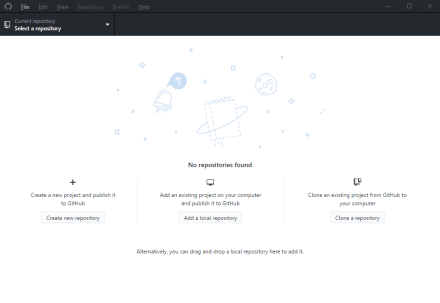


- 配置管理

GitHub上已自动配置的Mac笔记本电脑，一个工具，可以转换设置Linux或Windows机器。

BOXEN是GitHub的自动化工具，设置和配置的Mac笔记本电脑软件开发或其他类型的工作，正在使用他们的开发人员，律师，设计师，付货人，等。我们的想法是准备系统以自动方式和作为无差错尽可能用最少的干预工作。根据GitHub上，与一个新的开发机器上，他的Mac系统成立，并准备在30分钟内提交代码。

BOXEN的基础上收集了大量的几十个木偶模块，使设置的各种软件，如卡桑德拉，Mongo DB中，Java软件中，Python和Ruby开发中，节点，JS，nginx的，Skype公司，甚至MINECRAFT。虽然机器上配备了一个预配置，每个用户都可以调整它的配置应有的作用。

- Gitee

Gitee是开源中国（OSChina）推出的基于Git的代码托管服务。

Gitee包括三个版本，分别是：社区版、企业版和高校版。

- 发展历程

2016年，Gitee推出企业版，提供企业级代码托管服务 。	

- 主要功能

基于Git的代码托管服务。

### markdown

- markdown

Markdown是一种轻量级标记语言，创始人为约翰·格鲁伯（英语：John Gruber）。 它允许人们使用易读易写的纯文本格式]编写文档，然后转换成有效的XHTML或者HTML文档。这种语言吸收了很多在电子邮件中已有的纯文本标记的特性。

由于Markdown的轻量化、易读易写特性，并且对于图片，图表、数学式都有支持，许多网站都广泛使用Markdown来撰写帮助文档或是用于论坛上发表消息。 如GitHub、Reddit、Diaspora、Stack Exchange、OpenStreetMap 、SourceForge、简书等，甚至还能被使用来撰写电子书。

- 优势

世界上最流行的博客平台WordPress和大型CMS如Joomla、Drupal都能很好的支持Markdown。完全采用Markdown编辑器的博客平台有Ghost和Typecho等。

用于编写说明文档，以“README.md”的文件名保存在软件的目录下面。

Markdown可以快速转化为演讲PPT、Word产品文档甚至是用非常少量的代码完成最小可用原型。

- 发展历程

John Gruber在2004年创造了Markdown语言，在语法上有很大一部分是跟[亚伦·斯沃茨](https://baike.baidu.com/item/亚伦·斯沃茨/4027108)（Aaron Swartz）共同合作的。这个语言的目的是希望大家使用“易于阅读、易于撰写的纯文字格式，并选择性的转换成有效的XHTML（或是HTML）”。 其中最重要的设计是可读性，也就是说这个语言应该要能直接在字面上的被阅读，而不用被一些格式化指令标记（像是RTF与HTML）。 因此，它是现行电子邮件标记格式的惯例，虽然它也借鉴了很多早期的标记语言，如：Setext、Texile、reStructuredText。

**标准化**

Markdown已经成为典型的转换为HTML的非正式规范和参考实现。随着时间的推移，出现了许多Markdown实现。人们开发这些主要是由于在基本语法之上需要额外的功能 - 例如表格，脚注，定义列表（技术上的HTML描述列表）和HTML块内的Markdown。其中一些行为偏离了最开始的参考实现。与此同时，非正式规范中的一些含糊不清引起了人们的注意  。这些问题促使Markdown解析器的一些开发人员努力实现标准化。

2016年3月发布了RFC 7763和RFC 7764。RFC 7763 从原始变体引入了MIME类型 text/markdown。RFC 7764讨论并注册了MultiMarkdown、GitHub Flavored Markdown (GFM)、Pandoc、CommonMark及Markdown等变体。 

**CommonMark**

从2012年开始，包括Jeff Atwood和John MacFarlane在内的一群人启动了标准化工作。 一个社区网站旨在记录可用于文档作者和开发人员的各种工具和资源，以及各种markdown实现的实现者。 [5] 2014年9月，Gruber反对在这一工作中继续使用“Markdown”这个名字，其被更名为CommonMark。CommonMark发布了规范、参考实现和测试包的几个版本，并计划在2018年宣布最终的1.0规范和测试包。

**GFM**

2017年，GitHub发布了基于CommonMark的GitHub Flavored Markdown（GFM）的正式规范。 [8] 除了表格、删除线、自动链接和任务列表被GitHub规范作为扩展添加之外，它遵循CommonMark规范。 [9] GitHub还相应地更改了其站点上使用的解析器，这要求更改某些文档 - 例如，GFM要求创建标题的哈希符号由空格字符分隔。

**Markdown Extra**

Markdown Extra是一种轻量级标记语言，基于在PHP（最初）、Python和Ruby中实现的Markdown。它添加了普通Markdown语法不具备的功能。内容管理系统支持Markdown Extra，例如Drupal，TYPO3和MediaWiki。

它为Markdown添加了以下功能：

- HTML块内的markdown标记
- 具有id / class属性的元素
- 围栏代码块
- 表格
- 定义清单
- 脚注
- 缩写

Markdown是一种简单的格式化文本的方法，在任何设备上看起来都很棒。它不会做任何花哨的事情，比如改变字体大小、颜色或类型——只是基本的，使用你已经知道的键盘符号。

- 语法

**常用语法**

| **Markdown语法**  | **详解**                  | **快捷键**         | **效果**                                          |
| ----------------- | ------------------------- | ------------------ | ------------------------------------------------- |
| *斜体*            | 无                        | Ctrl/⌘ + I         | *斜体*                                            |
| **粗体**          | 无                        | Ctrl/⌘ + B         | **粗体**                                          |
| # 一级标题        | "#"后需加空格             | 无                 | 无                                                |
| ## 二级标题       | 以此类推三级标题为三个“#” | 无                 | 无                                                |
| [链接](http://a)  | “[ ]”间为显示的超文本     | Ctrl/⌘ + K         | [链接](https://baike.baidu.com/item/链接/2665501) |
|                   | “[ ]”间为图片名           | Ctrl/⌘ + Shift + I |                                                   |
| “ ＞ ”引用        | “ ＞ ”后需加空格          | Ctrl + Q           | 无                                                |
| * 无序列表        | 无                        | Ctrl + L           | 无                                                |
| 1. 有序列表       | 无                        | 无                 | 无                                                |
| ---               | 水平分割线                | 无                 | ————                                              |
| `内联代码` 的使用 | 无                        | Ctrl/⌘ + Shift + K | 无                                                |
| ```代码块```      | 无                        | 无                 | 无                                                |
| 颜色代码          | 无                        | 无                 | 无                                                |
| ***斜体+粗体***   | 无                        | 无                 | ***斜体+粗体\***                                  |
| 居中格式          | 文字                      | 无                 | 文字                                              |
| 自动换行          | 例：1234567890            | Enter              | 1234567890                                        |
| 输入框            | 例：1234                  | 无                 | 输入框内的1234                                    |
| 颜色第二种        | 文字                      | 无                 | 无                                                |
| 文字大小          | 文字                      | 无                 | 无                                                |
| 字体              | 无                        | 无                 | 无                                                |

- 编辑器

**Windows**

Typora、Simplenote、Laverna、Boostnote、Inkdrop、Cmd Markdown、Github、马克飞象、Yu Writer、看云、有道云笔记、为知笔记、蚂蚁笔记

**MacOS**

Typora、Typed、Ulysses、Falcon

**Linux**

Typora、Atom、GNU Emacs、Remarkable、Haroopad、ReText、UberWriter、Mark My Words

**Chromium内核浏览器插件**

Markdown Preview、Markdown Here

**Android**

Draft、JotterPad X、坚果云Markdown

**iOS**

Byword、simplenote、坚果云Markdown

RStudio是一个用于R的IDE，为称为sundown的Markdown变体提供了C++包装函数

## 开发环境的描述

Linux的环境，Windows的环境，maven进行环境部署。

### Linux

- Linux[^8]

Linux，全称GNU/Linux，是一种免费使用和自由传播的类UNIX操作系统，其内核由林纳斯·本纳第克特·托瓦兹于1991年10月5日首次发布，它主要受到Minix和Unix思想的启发，是一个基于POSIX的多用户、多任务、支持多线程和多CPU的操作系统。它能运行主要的Unix工具软件、应用程序和网络协议。它支持32位和64位硬件。Linux继承了Unix以网络为核心的设计思想，是一个性能稳定的多用户网络操作系统。Linux有上百种不同的发行版，如基于社区开发的debian、archlinux，和基于商业开发的Red Hat Enterprise Linux、SUSE、Oracle Linux等。

2021年6月，根据Linux 5.14刚刚进入合并队列的char-misc-next提交，Linux 5.14正式移除了RAW驱动。

- 特点

Linux，全称GNU/Linux，是一套免费使用和自由传播的类Unix操作系统，是一个基于POSIX的多用户、多任务、支持多线程和多CPU的操作系统。伴随着互联网的发展，Linux得到了来自全世界软件爱好者、组织、公司的支持。它除了在服务器方面保持着强劲的发展势头以外，在个人电脑、嵌入式系统上都有着长足的进步。使用者不仅可以直观地获取该操作系统的实现机制，而且可以根据自身的需要来修改完善Linux，使其最大化地适应用户的需要。

Linux不仅系统性能稳定，而且是开源软件。其核心防火墙组件性能高效、配置简单，保证了系统的安全。在很多企业网络中，为了追求速度和安全，Linux不仅仅是被网络运维人员当作服务器使用，甚至当作网络防火墙，这是Linux的一大亮点。

Linux具有开放源码、没有版权、技术社区用户多等特点，开放源码使得用户可以自由裁剪，灵活性高，功能强大，成本低。尤其系统中内嵌网络协议栈，经过适当的配置就可实现路由器的功能。这些特点使得Linux成为开发路由交换设备的理想开发平台。

- 主要特性

**基本思想**

Linux的基本思想有两点：第一，一切都是文件；第二，每个文件都有确定的用途。其中第一条详细来讲就是系统中的所有都归结为一个文件，包括命令、硬件和软件设备、操作系统、进程等等对于操作系统内核而言，都被视为拥有各自特性或类型的文件。至于说Linux是基于Unix的，很大程度上也是因为这两者的基本思想十分相近。

**完全免费**

Linux是一款免费的操作系统，用户可以通过网络或其他途径免费获得，并可以任意修改其源代码。这是其他的操作系统所做不到的。正是由于这一点，来自全世界的无数程序员参与了Linux的修改、编写工作，程序员可以根据自己的兴趣和灵感对其进行改变，这让Linux吸收了无数程序员的精华，不断壮大。

**完全兼容POSIX1.0标准**

这使得可以在Linux下通过相应的模拟器运行常见的DOS、Windows的程序。这为用户从Windows转到Linux奠定了基础。许多用户在考虑使用Linux时，就想到以前在Windows下常见的程序是否能正常运行，这一点就消除了他们的疑虑。

**多用户、多任务**

Linux支持多用户，各个用户对于自己的文件设备有自己特殊的权利，保证了各用户之间互不影响。多任务则是现代电脑最主要的一个特点，Linux可以使多个程序同时并独立地运行。

**良好的界面**

Linux同时具有字符界面和图形界面。在字符界面用户可以通过键盘输入相应的指令来进行操作。它同时也提供了类似Windows图形界面的X-Window系统，用户可以使用鼠标对其进行操作。在X-Window环境中就和在Windows中相似，可以说是一个Linux版的Windows。

**支持多种平台**

Linux可以运行在多种硬件平台上，如具有x86、680x0、SPARC、Alpha等处理器的平台。此外Linux还是一种嵌入式操作系统，可以运行在掌上电脑、机顶盒或游戏机上。2001年1月份发布的Linux 2.4版内核已经能够完全支持Intel64位芯片架构。同时Linux也支持多处理器技术。多个处理器同时工作，使系统性能大大提高。

- 优点

1.Linux由众多微内核组成，其源代码完全开源；

2.Linux继承了Unix的特性，具有非常强大的网络功能，其支持所有的因特网协议，包括TCP/IPv4、TCP/IPv6和链路层拓扑程序等，且可以利用Unix的网络特性开发出新的协议栈；

3.Linux系统工具链完整，简单操作就可以配置出合适的开发环境，可以简化开发过程，减少开发中仿真工具的障碍，使系统具有较强的移植性；

### Windows

- Windows操作系统

Windows操作系统，是由美国微软公司（Microsoft）研发的操作系统，问世于1985年。起初是MS-DOS模拟环境，后续由于微软对其进行不断更新升级，提升易用性，使Windows成为了应用最广泛的操作系统。

Windows采用了图形用户界面（GUI），比起从前的MS-DOS需要输入指令使用的方式更为人性化。随着计算机硬件和软件的不断升级，Windows也在不断升级，从架构的16位、32位再到64位，系统版本从最初的Windows 1.0到大家熟知的Windows 95、Windows 98、Windows 2000、Windows XP、Windows Vista、Windows 7、Windows 8、Windows 8.1、Windows 10、Windows 11和Windows Server服务器企业级操作系统，微软一直在致力于Windows操作系统的开发和完善。

- 系统简介

微软（Microsoft）公司从1983年开始研发Windows系统，最初的研发目标是在MS-DOS的基础上提供一个多任务的图形用户界面。第一个版本的Windows 1.0于1985年问世，它是一个具有图形用户界面的系统软件。1987年推出了Windows 2.0，最明显的变化是采用了相互叠盖的多窗口界面形式。但这一切都没有引起人们的关注。直到1990年微软推出Windows 3.0成为一个重要的里程碑，它以压倒性的商业成功确定了Windows系统在PC领域的垄断地位，现今流行的Windows窗口界面的基本形式也是从Windows3.0开始基本确定的。1992年主要针对Windows 3.0的缺点推出了Windows 3.1，为程序开发提供了功能强大的窗口控制能力，使Windows和在其环境下运行的应用程序具有了风格统一、操纵灵活、使用简便的用户界面。Windows3.1在内存管理上也取得了突破性进展。它使应用程序可以超过常规内存空间限制，不仅支持16MB内存寻址，而且在80386及以上的硬件配置上通过虚拟存储方式可以支持几倍于实际物理存储器大小的地址空间。Windows 3.1还提供了一定程度的网络支持、多媒体管理、超文本形式的联机帮助设施等，对应用程序的开发有很大影响 。

众所周知，Windows在个人计算机领域是普及度很高的操作系统。当计算机的体积不断变小，发展成掌上电脑的形态时，Windows系统自然也延伸到这类便携式产品的领域。然而，掌上电脑在续航能力、显示屏幕、输入界面等方面与普通的PC还是有很大差别的，考虑功耗和用户使用习惯等方面的因素，Windows系统针对手持设备的特点进行了多次调整和优化，先后形成了Windows CE，Windows Mobile，Windows Phone等移动版本的系统。

- 系统特点

**1、Windows操作系统的人机操作性优异。**

操作系统是人使用计算机硬件沟通的平台，没有良好的人机操作性，就难以吸引广大用户使用。手机领域，诺基亚手机能够占据手机市场半壁江山，手机操作系统互动性良好是其成功的重要因素之一，而其迅速的衰败也是因为操作系统的落伍。Windows操作系统能够作为个人计算机的主流操作系统，其优异的人机操作性是重要因素。Windows操作系统界面友好，窗口制作优美，操作动作易学，多代系统之间有良好的传承，计算机资源管理效率较高，效果较好 。

**2、Windows操作系统支持的应用软件较多。**

Windows操作系统作为优秀的操作系统，由开发操作系统的微软公司控制接口和设计，公开标准，因此，有大量商业公司在该操作系统上开发商业软件。Windows操作系统的大量应用软件为客户提供了方便。这些应用软件门类全，功能完善，用户体验性好。譬如，Windows操作系统有大量的多媒体应用软件，搜集管理多媒体资源，客户只需要使用这些基于系统开发出来商业软件就可以享受多媒体带来的快乐 。

**3、Windows操作系统对硬件支持良好。**

硬件的良好适应性是Windows操作系统的有一个重要特点。Windows操作系统支持多种硬件平台对于硬件生产厂商宽泛、自由的开发环境，激励了这些硬件公司选择与Windows操作系统相匹配，也激励了Windows操作系统不断完善和改进，同时，硬件技术的提升，也为操作系统功能拓展提供了支撑。另外，该操作系统支持多种硬件的热插拔，方便了用户的使用，也受到了广大用户的欢迎 。

- 系统版本

Windows 1.0是微软公司第一次对个人电脑操作平台进行用户图形界面的尝试。Windows 1.0基于MS-DOS操作系统。Microsoft Windows 1.0是Windows系列的第一个产品，于1985年开始发行 [6] 。当时很多人认为Windows 1.0只是一个低劣的产品。当时最好的GUI电脑平台是GEM。另外一个选择是Desqview/X [6] 。Windows 1.0中鼠标作用得到特别的重视，用户可以通过点击鼠标完成大部分的操作。Windows 1.0 自带了一些简单的应用程序，包括日历、记事本、计算器等等。总之，刚诞生的Windows 1.0，总会让人感到它像是一个PDA，甚至可能功能还赶不上PDA，不过这在Windows 1.0诞生时已经相当吸引人了。Windows 1.0的另外一个显著特点就是允许用户同时执行多个程序，并在各个程序之间进行切换，这对于DOS来说是不可想象的 [6] 。Windows 1.0 可以显示256种颜色，窗口可以任意缩放，当窗口最小化的时候桌面上会有专门的空间放置这些窗口（其实就是任务栏）。 在Windows 1.0中已经出现了控制面板（Control Panel），对驱动程序、虚拟内存有了明确的定义，不过功能非常有限。

### maven

- maven

Maven[^9]项目对象模型(POM)，可以通过一小段描述信息来管理项目的构建，报告和文档的项目管理工具软件。

Maven 除了以程序构建能力为特色之外，还提供高级项目管理工具。由于 Maven 的缺省构建规则有较高的可重用性，所以常常用两三行 Maven 构建脚本就可以构建简单的项目。由于 Maven 的面向项目的方法，许多 Apache Jakarta 项目发文时使用 Maven，而且公司项目采用 Maven 的比例在持续增长。

Maven这个单词来自于意第绪语（犹太语），意为知识的积累，最初在Jakata Turbine项目中用来简化构建过程。当时有一些项目（有各自Ant build文件），仅有细微的差别，而JAR文件都由CVS来维护。于是希望有一种标准化的方式构建项目，一个清晰的方式定义项目的组成，一个容易的方式发布项目的信息，以及一种简单的方式在多个项目中共享JARs。

- 管理特点

那么，Maven 和 Ant 有什么不同呢？在回答这个问题以前，首先要强调一点：Maven 和 Ant 针对构建问题的两个不同方面。Ant 为 Java 技术开发项目提供跨平台构建任务。Maven 本身描述项目的高级方面，它从 Ant 借用了绝大多数构建任务。因此，由于 Maven 和 Ant代表两个差异很大的工具，所以接下来只说明这两个工具的等同组件之间的区别，如表 1 所示。 

|                  | **Maven**                                                    | **Ant**                                                      |
| ---------------- | ------------------------------------------------------------ | ------------------------------------------------------------ |
| 标准构建文件     | project.xml 和 maven.xml                                     | build.xml                                                    |
| 特性处理顺序     | ${maven.home}/bin/driver.properties${project.home}/project.properties${project.home}/build.properties${user.home}/build.properties通过 -D 命令行选项定义的系统特性**最后一个**定义起决定作用。 | 通过 -D 命令行选项定义的系统特性由 任务装入的特性**第一个**定义最先被处理。 |
| 构建规则         | 构建规则更为动态（类似于编程语言）；它们是基于 Jelly 的可执行 XML。 | 构建规则或多或少是静态的，除非使用<script>任务               |
| 扩展语言         | 插件是用 Jelly（XML）编写的。                                | 插件是用 Java 语言编写的。                                   |
| 构建规则可扩展性 | 通过定义 <preGoal> 和 <postGoal> 使构建 goal 可扩展。        | 构建规则不易扩展；可通过使用 <script> 任务模拟 <preGoal> 和 <postGoal> 所起的作用。 |

Apache Maven是一个（特别是Java编程）项目管理及自动构建工具，由Apache软件基金会所提供。基于项目对象模型（缩写：POM）概念，Maven利用一个中央信息片断能管理一个项目的构建、报告和文档等步骤。

它包含了一个项目对象模型 (Project Object Model)，一组标准集合，一个项目生命周期项目生命周期)(Project Lifecycle)，一个依赖管理系统(Dependency Management System)，和用来运行定义在生命周期阶段(phase)中插件(plugin)目标(goal)的逻辑。当你使用Maven的时候，你用一个明确定义的项目对象模型来描述你的项目，然后Maven可以应用横切的逻辑，这些逻辑来自一组共享的（或者自定义的）插件。

Maven 有一个生命周期，当你运行 mvn install 的时候被调用。这条命令告诉 Maven 执行一系列的有序的步骤，直到到达你指定的生命周期。遍历生命周期旅途中的一个影响就是，Maven 运行了许多默认的插件目标，这些目标完成了像编译和创建一个 JAR 文件这样的工作。

此外，Maven能够很方便的帮你管理项目报告，生成站点，管理JAR文件，等等。

- 常用命令

mvn archetype:generate 创建Maven项目

mvn compile 编译源代码

mvn deploy 发布项目

mvn test-compile 编译测试源代码

mvn test 运行应用程序中的单元测试

mvn site 生成项目相关信息的网站

mvn clean 清除项目目录中的生成结果

mvn package 根据项目生成的jar

mvn install 在本地Repository中安装jar

mvn eclipse:eclipse 生成eclipse项目文件

mvnjetty:run 启动jetty服务

mvntomcat:run 启动tomcat服务

mvn clean package -Dmaven.test.skip=true:清除以前的包后重新打包，跳过测试类

- 生命周期

Maven的生命周期是为了对所有的构建过程进行了抽象了，便于统一。

**clean**(清理)

cleanup(清理所有)

此生命周期旨在给工程做清理工作，它主要包含以下阶段：

**pre-clean** - 执行项目清理前所需要的工作。

**clean** - 清理上一次build项目生成的文件。

**post-clean** - 执行完成项目清理所需的工作.

default(默认)

**validate** - 验证项目是否正确且所有必要的信息都可用。

**initialize** - 初始化构建工作，如：设置参数，创建目录等。

**generate-sources** - 为包含在编译范围内的代码生成源代码.

**process-sources** - 处理源代码, 如过滤值.

**generate-resources** -

**process-resources** - 复制并处理资源文件，至目标目录，准备打包。

**compile** - 编译项目中的源代码.

**process-classes** - 为编译生成的文件做后期工作, 例如做Java类的字节码增强.

**generate-test-sources** - 为编译内容生成测试源代码.

**process-test-sources** - 处理测试源代码。

**generate-test-resources** -

**process-test-resources** - 复制并处理资源文件，至目标测试目录。

**test-compile** - 将需测试源代码编译到路径。一般来说，是编译/src/test/java目录下的java文件至目标输出的测试classpath目录中。

**process-test-classes** -

**test** - 使用合适的单元测试框架运行测试。这些测试代码不会被打包或部署。

**prepare-package** -

**package** - 接受编译好的代码，打包成可发布的格式，如 JAR 。

**pre-integration-test** -

**integration-test** - 按需求将发布包部署到运行环境。

**post-integration-test** -

**verify** -

**install** -将包安装到本地仓库，给其他本地引用提供依赖。

**deploy** -完成集成和发布工作，将最终包复制到远程仓库以便分享给其他开发人员。

site(站点)

**pre-site** - 执行一些生成项目站点前的准备工作。

**site** - 生成项目站点的文档。

**post-site** - 执行需完成站点生成的工作，如站点部署的准备工作。

**site-deploy** - 向制定的web服务器部署站点生成文件。 

## 编程语言的描述

### Java

- Java

Java[^10]是一门面向对象的编程语言，不仅吸收了C++语言的各种优点，还摒弃了C++里难以理解的多继承、指针等概念，因此Java语言具有功能强大和简单易用两个特征。Java语言作为静态面向对象编程语言的代表，极好地实现了面向对象理论，允许程序员以优雅的思维方式进行复杂的编程。

Java具有简单性、面向对象、分布式、健壮性、安全性、平台独立与可移植性、多线程、动态性等特点。Java可以编写桌面应用程序、Web应用程序、分布式系统和嵌入式系统应用程序等。

- 编程开发

JDK（Java Development Kit）称为Java开发包或Java开发工具，是一个编写Java的Applet小程序和应用程序的程序开发环境。JDK是整个Java的核心，包括了Java运行环境（Java Runtime Environment），一些Java工具和Java的核心类库（Java API）。不论什么Java应用服务器实质都是内置了某个版本的JDK。主流的JDK是Sun公司发布的JDK，除了Sun之外，还有很多公司和组织都开发了自己的JDK，例如，IBM公司开发的JDK，BEA公司的Jrocket，还有GNU组织开发的JDK。

另外，可以把Java API类库中的Java SE API子集和Java虚拟机这两部分统称为JRE（JAVA Runtime Environment），JRE是支持Java程序运行的标准环境 。

JRE是个运行环境，JDK是个开发环境。因此写Java程序的时候需要JDK，而运行Java程序的时候就需要JRE。而JDK里面已经包含了JRE，因此只要安装了JDK，就可以编辑Java程序，也可以正常运行Java程序。但由于JDK包含了许多与运行无关的内容，占用的空间较大，因此运行普通的Java程序无须安装JDK，而只需要安装JRE即可。

- 语言特点

**1.简单性**

Java看起来设计得很像C++，但是为了使语言小和容易熟悉，设计者们把C++语言中许多可用的特征去掉了，这些特征是一般程序员很少使用的。例如，Java不支持goto语句，代之以提供break和continue语句以及异常处理。Java还剔除了C++的操作符过载（overload）和多继承特征，并且不使用主文件，免去了预处理程序。因为Java没有结构，数组和串都是对象，所以不需要指针。Java能够自动处理对象的引用和间接引用，实现自动的无用单元收集，使用户不必为存储管理问题烦恼，能更多的时间和精力花在研发上。

**2.面向对象**

Java是一个面向对象的语言。对程序员来说，这意味着要注意其中的数据和操纵数据的方法（method），而不是严格地用过程来思考。在一个面向对象的系统中，类（class）是数据和操作数据的方法的集合。数据和方法一起描述对象（object）的状态和行为。每一对象是其状态和行为的封装。类是按一定体系和层次安排的，使得子类可以从超类继承行为。在这个类层次体系中有一个根类，它是具有一般行为的类。Java程序是用类来组织的。

Java还包括一个类的扩展集合，分别组成各种程序包（Package），用户可以在自己的程序中使用。例如，Java提供产生图形用户接口部件的类（java.awt包），这里awt是抽象窗口工具集（abstract windowing toolkit）的缩写，处理输入输出的类（java.io包）和支持网络功能的类（java.net包）。

**3.分布性**

Java设计成支持在网络上应用，它是分布式语言。Java既支持各种层次的网络连接，又以Socket类支持可靠的流（stream）网络连接，所以用户可以产生分布式的客户机和服务器。

网络变成软件应用的分布运载工具。Java程序只要编写一次，就可到处运行。

**4.编译和解释性**

Java编译程序生成字节码*（byte-code）*，而不是通常的机器码。Java字节码提供对体系结构中性的目标文件格式，代码设计成可有效地传送程序到多个平台。Java程序可以在任何实现了Java解释程序和运行系统*（run-time system）*的系统上运行。

在一个解释性的环境中，程序开发的标准“链接”阶段大大消失了。如果说Java还有一个链接阶段，它只是把新类装进环境的过程，它是增量式的、轻量级的过程。因此，Java支持快速原型和容易试验，它将导致快速程序开发。这是一个与传统的、耗时的“编译、链接和测试”形成鲜明对比的精巧的开发过程。

**5.稳健性**


Java原来是用作编写消费类家用电子产品软件的语言，所以它是被设计成写高可靠和稳健软件的。Java消除了某些编程错误，使得用它写可靠软件相当容易。

Java是一个强类型语言，它允许扩展编译时检查潜在类型不匹配问题的功能。Java要求显式的方法声明，它不支持C风格的隐式声明。这些严格的要求保证编译程序能捕捉调用错误，这就导致更可靠的程序。

可靠性方面最重要的增强之一是Java的存储模型。Java不支持指针，它消除重写存储和讹误数据的可能性。类似地，Java自动的“无用单元收集”预防存储漏泄和其它有关动态存储分配和解除分配的有害错误。Java解释程序也执行许多运行时的检查，诸如验证所有数组和串访问是否在界限之内。

异常处理是Java中使得程序更稳健的另一个特征。异常是某种类似于错误的异常条件出现的信号。使用try/catch/finally语句，程序员可以找到出错的处理代码，这就简化了出错处理和恢复的任务。

**6.安全性**

Java的存储分配模型是它防御恶意代码的主要方法之一。Java没有指针，所以程序员不能得到隐蔽起来的内幕和伪造指针去指向存储器。更重要的是，Java编译程序不处理存储安排决策，所以程序员不能通过查看声明去猜测类的实际存储安排。编译的Java代码中的存储引用在运行时由Java解释程序决定实际存储地址。

Java运行系统使用字节码验证过程来保证装载到网络上的代码不违背任何Java语言限制。这个安全机制部分包括类如何从网上装载。例如，装载的类是放在分开的名字空间而不是局部类，预防恶意的小应用程序用它自己的版本来代替标准Java类。

**7.可移植性**

Java使得语言声明不依赖于实现的方面。例如，Java显式说明每个基本数据类型的大小和它的运算行为*（这些数据类型由Java语法描述）*。

Java环境本身对新的硬件平台和操作系统是可移植的。Java编译程序也用Java编写，而Java运行系统用ANSIC语言编写。

**8.高性能**

Java是一种先编译后解释的语言，所以它不如全编译性语言快。但是有些情况下性能是很要紧的，为了支持这些情况，Java设计者制作了“及时”编译程序，它能在运行时把Java字节码翻译成特定CPU（中央处理器）的机器代码，也就是实现全编译了。

Java字节码格式设计时考虑到这些“及时”编译程序的需要，所以生成机器代码的过程相当简单，它能产生相当好的代码。

**9.多线程性**

Java是多线程语言，它提供支持多线程的执行（也称为轻便过程），能处理不同任务，使具有线索的程序设计很容易。Java的lang包提供一个Thread类，它支持开始线索、运行线索、停止线索和检查线索状态的方法。

Java的线索支持也包括一组同步原语。这些原语是基于监督程序和条件变量风范，由C.A.R.Haore开发的广泛使用的同步化方案。用关键词synchronized，程序员可以说明某些方法在一个类中不能并发地运行。这些方法在监督程序控制之下，确保变量维持在一个一致的状态。

**10.动态性**

Java语言设计成适应于变化的环境，它是一个动态的语言。例如，Java中的类是根据需要载入的，甚至有些是通过网络获取的。

- 工作原理

  由四方面组成：

  （1）Java编程语言
  
  （2）Java类文件格式
  
  （3）Java虚拟机
  
  （4）Java应用程序接口
  
  当编辑并运行一个Java程序时，需要同时涉及到这四种方面。使用文字编辑软件*（例如记事、写字板、UltraEdit等或集成开发环境在Java源文件中定义不同的类 [26] ，通过调用类*（这些类实现了Java API）中的方法来访问资源系统，把源文件编译生成一种二进制中间码，存储在class文件中，然后再通过运行与操作系统平台环境相对应的Java虚拟机来运行class文件，执行编译产生的字节码，调用class文件中实现的方法来满足程序的Java API调用 。
  

### bootstrap

Bootstrap是美国Twitter公司的设计师Mark Otto和Jacob Thornton合作基于HTML、CSS、JavaScript 开发的简洁、直观、强悍的前端开发框架，使得 Web 开发更加快捷。Bootstrap提供了优雅的HTML和CSS规范，它即是由动态CSS语言Less写成。Bootstrap一经推出后颇受欢迎，一直是GitHub上的热门开源项目，包括NASA的MSNBC（微软全国广播公司）的Breaking News都使用了该项目。 国内一些移动开发者较为熟悉的框架，如WeX5前端开源框架等，也是基于Bootstrap源码进行性能优化而来。

## 数据库

MySQL 是最流行的关系型数据库管理系统，在 WEB 应用方面 MySQL 是最好的 RDBMS(Relational Database Management System：关系数据库管理系统)应用软件之一。

1. 什么是数据库

数据库（Database）是按照数据结构来组织、存储和管理数据的仓库。

每个数据库都有一个或多个不同的 API 用于创建，访问，管理，搜索和复制所保存的数据。

我们也可以将数据存储在文件中，但是在文件中读写数据速度相对较慢。

所以，现在我们使用关系型数据库管理系统（RDBMS）来存储和管理大数据量。所谓的关系型数据库，是建立在关系模型基础上的数据库，借助于集合代数等数学概念和方法来处理数据库中的数据。

RDBMS 即关系数据库管理系统(Relational Database Management System)的特点：

- 1.数据以表格的形式出现
- 2.每行为各种记录名称
- 3.每列为记录名称所对应的数据域
- 4.许多的行和列组成一张表单
- 5.若干的表单组成database

2. MySQL数据库

MySQL 是一个关系型数据库管理系统，由瑞典 MySQL AB 公司开发，目前属于 Oracle 公司。MySQL 是一种关联数据库管理系统，关联数据库将数据保存在不同的表中，而不是将所有数据放在一个大仓库内，这样就增加了速度并提高了灵活性。

- MySQL 是开源的，目前隶属于 Oracle 旗下产品。
- MySQL 支持大型的数据库。可以处理拥有上千万条记录的大型数据库。
- MySQL 使用标准的 SQL 数据语言形式。
- MySQL 可以运行于多个系统上，并且支持多种语言。这些编程语言包括 C、C++、Python、Java、Perl、PHP、Eiffel、Ruby 和 Tcl 等。
- MySQL 对PHP有很好的支持，PHP 是目前最流行的 Web 开发语言。
- MySQL 支持大型数据库，支持 5000 万条记录的数据仓库，32 位系统表文件最大可支持 4GB，64 位系统支持最大的表文件为8TB。
- MySQL 是可以定制的，采用了 GPL 协议，你可以修改源码来开发自己的 MySQL 系统。

## 技术的选型

### SSM

SSM[^11]（Spring+SpringMVC+MyBatis）框架集由Spring、MyBatis两个开源框架整合而成（SpringMVC是Spring中的部分内容），常作为数据源较简单的web项目的框架。

**Spring**

Spring就像是整个项目中装配bean的大工厂，在配置文件中可以指定使用特定的参数去调用实体类的构造方法来实例化对象。也可以称之为项目中的粘合剂。

Spring的核心思想是IoC（控制反转），即不再需要程序员去显式地`new`一个对象，而是让Spring框架帮你来完成这一切。

**SpringMVC**

SpringMVC在项目中拦截用户请求，它的核心Servlet即DispatcherServlet承担中介或是前台这样的职责，将用户请求通过HandlerMapping去匹配Controller，Controller就是具体对应请求所执行的操作。SpringMVC相当于SSH框架中struts。

**mybatis**

mybatis是对jdbc的封装，它让数据库底层操作变的透明。mybatis的操作都是围绕一个sqlSessionFactory实例展开的。mybatis通过配置文件关联到各实体类的Mapper文件，Mapper文件中配置了每个类对数据库所需进行的sql语句映射。在每次与数据库交互时，通过sqlSessionFactory拿到一个sqlSession，再执行sql命令。

页面发送请求给控制器，控制器调用业务层处理逻辑，逻辑层向持久层发送请求，持久层与数据库交互，后将结果返回给业务层，业务层将处理逻辑发送给控制器，控制器再调用视图展现数据。

### JSP

JSP(Java Server Pages)是由Sun Microsystems公司倡导、许多公司参与一起建立的一种动态网页技术标准，类似于其他技术标准，如ASP，PHP等，主要用于开发动态网页内容。

JSP是新一代的动态内容编程技术，它继承了Java技术的“一次编写，随处运行”的特性，允许Web开发人员开发和维护与平台无关，信息丰富动态的Web页面，包括HTML，DHTML，XHTML和XML，它能使Web开发人员轻易搭建网络平台，建立起功能强大的Web网站。JSP可以把用户界面从内容层次中分离出来，使得Web开发人员不必修改在底层的动态内容，就可以修改整体的页面布局。


### MySQL

数据库（Database）是一系列信息资源的集合。在一个数据库中，与一个项目有关的所有信息都可以叫做一条记录(Record)。每一条记录都是由一系列的字段(Field)组成的。一系列记录的集合就构成了数据表格(Table)。对于一个简单的“平面文件”的数据库来说，它仅包含了一个数据表格，而对一个“关系型”数据库来说，它却包含两个或两个以上的数据表格，表格的各字段之间存在这一种或多种关系（有时可以把这种关系叫做“链接”）。

*mysql*的特点

ySQL是一种开放源代码的关系型数据库管理系统（RDBMS），MySQL数据库系统使用最常用的数据库管理语言--结构化查询语言（SQL）进行数据库管理。

由于MySQL是开放源代码的，因此任何人都可以在General Public License的许可下下载并根据个性化的需要对其进行修改。MySQL因为其速度、可靠性和适应性而备受关注。大多数人都认为在不需要事务化处理的情况下，MySQL是管理内容最好的选择。它使用系统核心提供的多线程机制提供完全的多线程运行模式，提供了面向C、C++、Eiffel、Java、Perl、PHP、Python以及Tcl等编程语言的编程接口（APIs），支持多种字段类型并且提供了完整的操作符支持查询中的SELECT和WHERE操作。

目前MySQL被广泛地应用在Internet上的中小型网站中。由于其体积小、速度快、总体拥有成本低，尤其是开放源码这一特点，许多中小型网站为了降低网站总体拥有成本而选择了MySQL作为网站数据库。

## 编辑工具

### IDEA

IDEA 全称 IntelliJ IDEA，是java编程语言开发的集成环境。IntelliJ在业界被公认为最好的java开发工具，尤其在智能代码助手、代码自动提示、重构、JavaEE支持、各类版本工具(git、svn等)、JUnit、CVS整合、代码分析、 创新的GUI设计等方面的功能可以说是超常的。IDEA是JetBrains公司的产品，这家公司总部位于捷克共和国的首都布拉格，开发人员以严谨著称的东欧程序员为主。它的旗舰版本还支持HTML，CSS，PHP，MySQL，Python等。免费版只支持Java,Kotlin等少数语言。

### SQLyog

SQLyog 是一个快速而简洁的图形化管理MYSQL数据库的工具，它能够在任何地点有效地管理你的数据库，由业界著名的Webyog公司出品。
使用SQLyog可以快速直观地让您从世界的任何角落通过网络来维护远端的MySQL数据库。

### sublime text

Sublime Text 是一个文本编辑器（收费软件，可以无限期试用），同时也是一个先进的代码编辑器。Sublime Text是由程序员Jon Skinner于2008年1月份所开发出来，它最初被设计为一个具有丰富扩展功能的Vim。

Sublime Text具有漂亮的用户界面和强大的功能，例如代码缩略图，Python的插件，代码段等。还可自定义键绑定，菜单和工具栏。Sublime Text 的主要功能包括：拼写检查，书签，完整的 Python API ， Goto 功能，即时项目切换，多选择，多窗口等等。Sublime Text 是一个跨平台的编辑器，同时支持Windows、Linux、Mac OS X等操作系统。

# 系统设计

### 需求分析

在浏览器网页中展示员工的ID、姓名、性别、邮箱、部门等信息，可以查询员工信息、增加员工、修改员工信息、离职删除员工信息。

### 模型创建

***员工信息标***

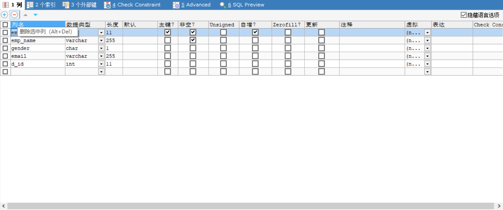

***部门信息标***


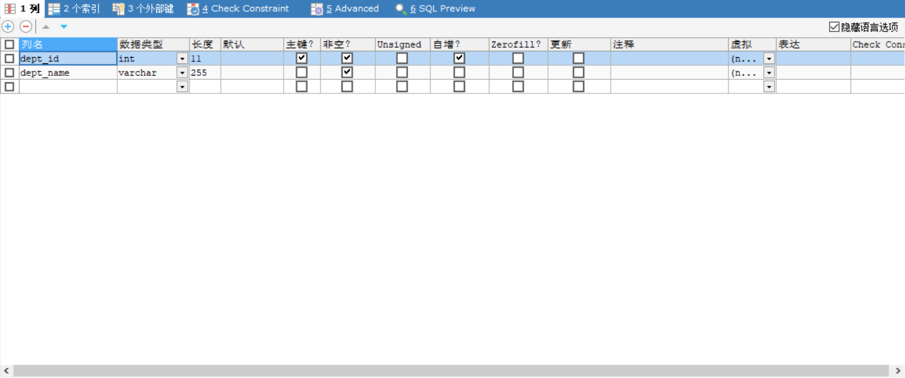

外键为部门信息标的dept_id项，

- 实体模型

  部门模型

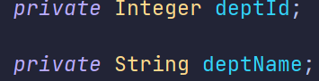

员工信息模型

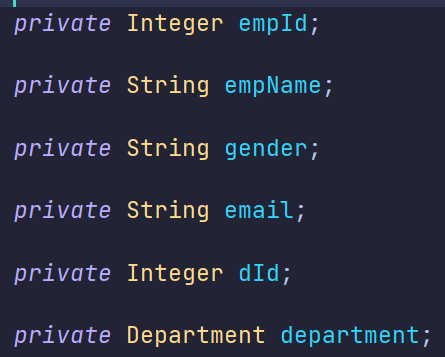


### RESTful风格

RESTful[^12]架构是对MVC架构改进后所形成的一种架构，通过使用事先定义好的接口与不同的服务联系起来。在RESTful架构中，浏览器使用POST，DELETE，PUT和GET四种请求方式分别对指定的URL资源进行增删改查操作。因此，RESTful是通过URI实现对资源的管理及访问，具有扩展性强、结构清晰的特点。

RESTful架构将服务器分成前端服务器和后端服务器两部分，前端服务器为用户提供无模型的视图；后端服务器为前端服务器提供接口。浏览器向前端服务器请求视图，通过视图中包含的AJAX函数发起接口请求获取模型。

### 接口设计

在计算机中，接口是计算机系统中两个独立的部件进行信息交换的共享边界。这种交换可以发生在计算机软、硬件，外部设备或进行操作的人之间，也可以是它们的结合。

| 功能         | 请求方式 | 描述      |
| ------------ | -------- | --------- |
| 添加信息     | POST     | /emp      |
| 删除员工信息 | DELETE   | /emp/{id} |
| 修改员工信息 | PUT      | /emp/{id} |
| 查询员工信息 | GET      | /emp/{id} |

### 页面设计

前端页面设计，使用Bootstra进行快速搭建页面模板，模板样式，如视频所示。下面是例图 ：

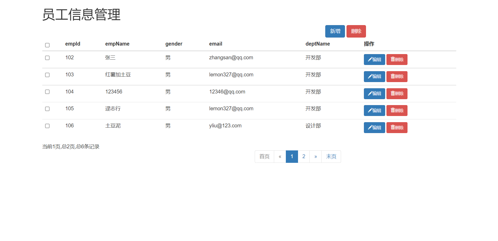


如图所示，因为能力和开发时间所受限，未能将项目布置完整。望老师见谅。

# 代码实现

分为3层，dao层、service层、controller层。

### dao层

dao层使用MyBatis和MyBatis的逆向化工程实现。实现步骤，将MyBatis注入到Spring容器中。

```xml
 <!--spring配置文件-->
    <!--配置数据源，事务控制-->
    <context:property-placeholder location="classpath:dbconfig.properties"/>
    <bean id="dataSource" class="com.mchange.v2.c3p0.ComboPooledDataSource" destroy-method="close">
        <property name="jdbcUrl" value="${jdbc.jdbcUrl}"/>
        <property name="user" value="${jdbc.user}"/>
        <property name="password" value="${jdbc.password}"/>
        <property name="driverClass" value="${jdbc.driverClass}"/>
    </bean>

    <!--事务控制-->
    <bean id="transactionManager" class="org.springframework.jdbc.datasource.DataSourceTransactionManager">
        <property name="dataSource" ref="dataSource"/>
    </bean>
    <aop:config>
        <aop:pointcut id="txPoint" expression="execution(* com.wheat.service..*(..))"/>
        <aop:advisor advice-ref="txAdvice" pointcut-ref="txPoint"/>
    </aop:config>
    <!--切入点-->
    <tx:advice id="txAdvice" transaction-manager="transactionManager">
        <tx:attributes>
            <tx:method name="*"/>
            <tx:method name="get" read-only="true"/>
        </tx:attributes>
    </tx:advice>
    <!--=================================-->
    <!--Mybatis配置-->
    <bean id="sqlSessionFactory" class="org.mybatis.spring.SqlSessionFactoryBean">
        <property name="configLocation" value="classpath:mybatis.xml"/>
        <property name="dataSource" ref="dataSource"/>
        <property name="mapperLocations" value="classpath:mappers/*.xml"/>
    </bean>

    <!--    配置扫描器，将Mybatis接口实现加入到ioc容器中-->
    <bean class="org.mybatis.spring.mapper.MapperScannerConfigurer">
        <property name="basePackage" value="com.wheat.dao"/>
    </bean>
    <!--    配置一个可以批量执行的sqlSession-->
    <bean id="sessionTemplate" class="org.mybatis.spring.SqlSessionTemplate">
        <constructor-arg name="sqlSessionFactory" ref="sqlSessionFactory"/>
        <constructor-arg name="executorType" value="BATCH"/>
    </bean>
```


实现MyBatis的逆向化工程，先引入所需的jar包，

```xml
		<dependency>
            <groupId>org.mybatis.generator</groupId>
            <artifactId>mybatis-generator-core</artifactId>
            <version>1.3.5</version>
        </dependency>
```


再编写实现mybatis-generator-core（MyBatis逆向工程）的配置文件，

```xml
<context id="DB2Tables" targetRuntime="MyBatis3">
		<commentGenerator>
			<property name="suppressAllComments" value="true" />
		</commentGenerator>
		<!-- 配置数据库连接  -->
		<jdbcConnection driverClass="com.mysql.jdbc.Driver"
			connectionURL="jdbc:mysql://localhost:3603/crud" userId="tea"
			password="pig">
		</jdbcConnection>

		<javaTypeResolver>
			<property name="forceBigDecimals" value="false" />
		</javaTypeResolver>

		<!-- 指定javaBean生成的位置 -->
		<javaModelGenerator targetPackage="com.wheat.bean"
			targetProject="src\main\java">
			<property name="enableSubPackages" value="true" />
			<property name="trimStrings" value="true" />
		</javaModelGenerator>

		<!--指定sql映射文件生成的位置 -->
		<sqlMapGenerator targetPackage="mappers" targetProject="src\main\resources">
			<property name="enableSubPackages" value="true" />
		</sqlMapGenerator>

		<!-- 指定dao接口生成的位置，mapper接口 -->
		<javaClientGenerator type="XMLMAPPER"
			targetPackage="com.wheat.dao" targetProject="src\main\java">
			<property name="enableSubPackages" value="true" />
		</javaClientGenerator>


		<!-- table指定每个表的生成策略 -->
		<table tableName="emp" domainObjectName="Employee"></table>
		<table tableName="dept" domainObjectName="Department"></table>
	</context>
```


实现MyBatis的逆向化工程。

```java
public void test() throws Exception{
        List<String> warnings = new ArrayList<String>();
        boolean overwrite = true;
        File configFile = new File("mbg.xml");
        ConfigurationParser cp = new ConfigurationParser(warnings);
        Configuration config = cp.parseConfiguration(configFile);
        DefaultShellCallback callback = new DefaultShellCallback(overwrite);
        MyBatisGenerator myBatisGenerator = new MyBatisGenerator(config,
                callback, warnings);
        myBatisGenerator.generate(null);

    }
```


最后生成的mapper文件和dao层代码

| dao层                           | mapper               |
| ------------------------------- | -------------------- |
| interface DepartmentMapper.java | DepartmentMapper.xml |
| interface EmployeeMapper.java   | EmployeeMapper.xml   |
|                                 |                      |


对dao层进行测试，利用Spring的自动注入注解，

```java
 @Autowired
    DepartmentMapper departmentMapper;

    @Autowired
    EmployeeMapper employeeMapper;

    @Autowired
    SqlSession sqlSession;
```

测试代码

```java
`  Employee employee = employeeMapper.selectByPrimaryKeyWithDept(103);
        // Employee employee = employeeMapper.selectByPrimaryKey(1);
        System.out.println(employee.getDepartment().getDeptName()+employee.getDepartment().getDeptId());
        System.out.println(employee.getDepartment());
```

查看输出、查看数据库是否更新数据。

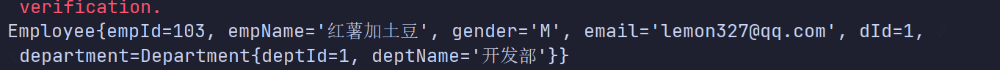

通过实体类自带的tostring方法，得输出的结果。下图是数据图文件的内容。通过sqlyog显示。


通过命令行查询的结果，数据库的可视化界面更具有操作性。


数据相匹配，查询成功。

dao层测试完成，继续晚上项目代码。

测试成功，对service层进行编写。

### service层

|                   |      |
| ----------------- | ---- |
| EmployeeService   |      |
| DepartmentService |      |
|                   |      |

service层的代码结构：

DepartmentService：

```java
	@Autowired
    private DepartmentMapper departmentMapper;

    /**
     * @return 查询所有部门
     */
    public List<Department> getDepts(){
        List<Department> depts = departmentMapper.selectByExample(null);
        return depts;
    }
```


通过Spring的注解，自动注入departmentMapper，通过dao层，查询所有部门信息。


EmployeeService的代码：

```java
    //自动注入mapper接口
@Autowired
EmployeeMapper employeeMapper;

    /**
     * @return 查询所有员工
     */
public List<Employee> getAll(){
    return employeeMapper.selectByExampleWithDept(null);
}

    /**
     * @param employee 保存员工
     */
public void saveEmp(Employee employee){
    employeeMapper.insert(employee);
}

    /**
     * 检查用户名是否可用
     * @param name 用户名
     * @return true代表可用，false代表不可用
     */
public boolean checkUser(String name){
    EmployeeExample example = new EmployeeExample();
    EmployeeExample.Criteria criteria = example.createCriteria();
    criteria.andEmpNameEqualTo(name);

    long l = employeeMapper.countByExample(example);
    return l == 0;

}

	/**
     * 通过主键查询员工信息
     * @param id 员工id
     * @return 返回员工信息
     */
    public Employee getEmp(Integer id){
        return employeeMapper.selectByPrimaryKeyWithDept(id);
    }

    /**
     * 更新员工信息
     *
     * @param employee 要更新的员工
     */
    public void updateEmp(Employee employee){
        employeeMapper.updateByPrimaryKeySelective(employee);
    }

    /**
     * 删除员工
     *
     * @param id 通过id删除员工
     */
    public void deleteEmp(Integer id){
        employeeMapper.deleteByPrimaryKey(id);
    }

    /**
     * 删除多个员工
     *
     * @param id 一个list集合的员工id信息
     */
    public void deleteBatch(List<Integer> id){
        EmployeeExample employeeExample = new EmployeeExample();
        EmployeeExample.Criteria criteria = employeeExample.createCriteria();
        criteria.andEmpIdIn(id);
        employeeMapper.deleteByExample(employeeExample);

    }
```


### controller层

编写一个bean，用来提示状态信息。

```java
public class Msg{
    // 状态码
    private Integer code;
    // 提示信息
    private String msg;
    // 用来存储数据
    private Map<String, Object> extend = new HashMap<String, Object>();

    //处理成功，响应码为100，可自定义
    public static Msg success(){
        Msg result = new Msg();
        result.setCode(100);
        result.setMsg("处理成功！");
        return result;
    }

    //处理失败，响应码为200。
    public static Msg fail(){
        Msg result = new Msg();
        result.setCode(200);
        result.setMsg("处理失败！");
        return result;
    }

    //添加信息
    public Msg add(String key, Object value){
        this.getExtend().put(key, value);
        return this;
    }

    public Integer getCode(){
        return code;
    }

    public void setCode(Integer code){
        this.code = code;
    }

    public String getMsg(){
        return msg;
    }

    public void setMsg(String msg){
        this.msg = msg;
    }

    public Map<String, Object> getExtend(){
        return extend;
    }

    public void setExtend(Map<String, Object> extend){
        this.extend = extend;
    }
}
```


DepartmentController：

```java
// 控制器，控制器Controller 负责处理由DispatcherServlet 分发的请求
@Controller
public class DepartmentController{
	// 自动注入
    @Autowired
    private DepartmentService departmentService;
	//@RequestMapping 映射请求
    @RequestMapping("/depts")
    //@ResponseBody的作用是将java对象转为json格式的数据。
    @ResponseBody
    public Msg getDepts(){
        List<Department> depts = departmentService.getDepts();
        return Msg.success().add("depts", depts);
    }

}
```


```java
@Controller
public class EmployeeController{

    @Autowired
    EmployeeService employeeService;

    @RequestMapping("/")
    public String index1(){
        return "index";
    }
    
    // 使用分页插件，完成分页功能。

    /**
     * @param pn 页数
     * @return 查询所有员工信息
     */
    @RequestMapping("/emps")
    @ResponseBody
    public Msg getEmpsWithJson(@RequestParam(value = "pn", defaultValue = "1") Integer pn){
        PageHelper.startPage(pn, 5);

        List<Employee> emps = employeeService.getAll();

        PageInfo pageInfo = new PageInfo(emps, 5);

        return Msg.success().add("pageInfo", pageInfo);
    }

    /**
     * @param employee
     * @return 保存员工
     */
    @RequestMapping(value = "/emp", method = RequestMethod.POST)
    @ResponseBody
    public Msg saveEmp(@Valid Employee employee, BindingResult result){
        if (result.hasErrors()) {
            // Map<String, Object> map = new HashMap<>();
            Map<String, Object> map = new HashMap<String, Object>();
            List<FieldError> errors = result.getFieldErrors();
            for(FieldError error : errors){
                System.out.println("错误的字段名：" + error.getField());
                System.out.println("" + error.getDefaultMessage());
                map.put(error.getField(), error.getDefaultMessage());
            }
            return Msg.fail().add("errorFields", map);
        } else{
            employeeService.saveEmp(employee);

            return Msg.success();
        }
    }


    /**
     * @param empName
     * @return 后端校验用户名和邮箱是否可用
     */
    @RequestMapping("/checkuser")
    @ResponseBody
    public Msg checkuser(@RequestParam("empName") String empName){
        String regx = "(^[a-zA-Z0-9_-]{6,16}$)|(^[\u2E80-\u9FFF]{2,5})";
        if (! empName.matches(regx)) {
            return Msg.fail().add("va_msg", "用户名必须是6-16位数字和字母的组合或者2-5位中文");
        }
        boolean b = employeeService.checkUser(empName);
        if (b) {
            return Msg.success();
        } else{
            return Msg.fail().add("va_msg", "用户名不可用");
        }
    }

    /**
     * @param id
     * @return 查询单个员工信息
     */
    @RequestMapping(value = "/emp/{id}", method = RequestMethod.GET)
    @ResponseBody
    public Msg getEmp(@PathVariable("id") Integer id){
        Employee emp = employeeService.getEmp(id);
        return Msg.success().add("emp", emp);

    }

    /**
     * 发送put请求，更新员工信息
     * @param employee 请求路径
     * @param request 请求方式
     * @return 返回一个Msg的实体类
     */
    @RequestMapping(value = "/emp/{empId}", method = RequestMethod.PUT)
    @ResponseBody
    public Msg updateEmp(Employee employee, HttpServletRequest request){
        employeeService.updateEmp(employee);
        return Msg.success();
    }

    /**
     * 删除员工，分为批量删除和单个删除
     * 批量删除，带有‘-’
     *
     * @param ids
     * @return
     */
    @ResponseBody
    @RequestMapping(value = "/emp/{ids}", method = RequestMethod.DELETE)
    public Msg deleteEmp(@PathVariable("ids") String ids){
        if (ids.contains("-")) {
            List<Integer> list = new ArrayList<Integer>();
            String[] split = ids.split("-");
            for(String s : split){
                list.add(Integer.parseInt(s));
            }
            employeeService.deleteBatch(list);
        } else{
            Integer id = Integer.parseInt(ids);
            employeeService.deleteEmp(id);
        }
        return Msg.success();

    }
}
```

对接口进行测试，启动服务器，访问指定的url地址。

```json
{"code":100,"msg":"处理成功！","extend":{"pageInfo":{"pageNum":1,"pageSize":5,"size":5,"startRow":1,"endRow":5,"total":6,"pages":2,"list":[{"empId":102,"empName":"张三","gender":"M","email":"zhangsan@qq.com","dId":1,"department":{"deptId":1,"deptName":"开发部"}},{"empId":103,"empName":"红薯加土豆","gender":"M","email":"lemon327@qq.com","dId":1,"department":{"deptId":1,"deptName":"开发部"}},{"empId":104,"empName":"123456","gender":"M","email":"12346@qq.com","dId":1,"department":{"deptId":1,"deptName":"开发部"}},{"empId":105,"empName":"逯志行","gender":"M","email":"lemon327@qq.com","dId":1,"department":{"deptId":1,"deptName":"开发部"}},{"empId":106,"empName":"土豆泥","gender":"M","email":"yliu@123.com","dId":2,"department":{"deptId":2,"deptName":"设计部"}}],"prePage":0,"nextPage":2,"isFirstPage":true,"isLastPage":false,"hasPreviousPage":false,"hasNextPage":true,"navigatePages":5,"navigatepageNums":[1,2],"navigateFirstPage":1,"navigateLastPage":2,"lastPage":2,"firstPage":1}}}
```


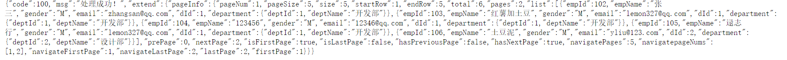

获得的json数据为上图，截屏如此。

接口地址为：`http://localhost:9676/believe/emps`

在Get方法中，有分页信息，使用的是MyBatis的分页插件。

在pom.xml中的信息是：

```xml
<!-- https://mvnrepository.com/artifact/com.github.pagehelper/pagehelper -->
<dependency>
    <groupId>com.github.pagehelper</groupId>
    <artifactId>pagehelper</artifactId>
    <version>5.3.0</version>
</dependency>
```


在mybatis.xml文件中配置pagehelper插件的信息：

```xml
<plugins>
    <plugin interceptor="com.github.pagehelper.PageInterceptor">
        <!--分页参数合理化-->
        <property name="reasonable" value="true"/>
    </plugin>
</plugins>
```

参数合理化，如果没有这项的化，分页信息会出现错误信息（已被此处折磨良久，特以标注）。


### 视图层

页面的设计。

页面使用jsp的开发。

页面模板使用的是：InternalResourceViewResolver。

```xml
<bean class="org.springframework.web.servlet.view.InternalResourceViewResolver">
    <property name="prefix" value="/WEB-INF/views/"></property>
    <property name="suffix" value=".jsp"></property>
</bean>
```

视图模板在spring中的配置信息。

视图的前缀是“/WEB-INF/views/ ”，视图的后缀是“.jsp”。在controller层中的，@Mapping注解返回类型是string类型，为范文的视图地址。会根据视图解析器，找到所适配的视图。

具体信息，需要进行调试。


基础模板

```html
<!--
  User: wheat
  Date: 2022/4/16
  Time: 21:29
-->

<!-- 员工修改的模态框 -->
<div class="modal fade" id="empUpdateModal" tabindex="-1" role="dialog" aria-labelledby="myModalLabel">
    <div class="modal-dialog" role="document">
        <div class="modal-content">
            <div class="modal-header">
                <button type="button" class="close" data-dismiss="modal" aria-label="Close"><span aria-hidden="true">&times;</span>
                </button>
                <h4 class="modal-title">员工修改</h4>
            </div>
            <div class="modal-body">
                <form class="form-horizontal">
                    <div class="form-group">
                        <label class="col-sm-2 control-label">empName</label>
                        <div class="col-sm-10">
                            <p class="form-control-static" id="empName_update_static"></p>
                        </div>

                    </div>
                    <div class="form-group">
                        <label class="col-sm-2 control-label">email</label>
                        <div class="col-sm-10">
                            <input type="text" name="email" class="form-control" id="email_update_input"
                                   placeholder="email@atguigu.com">
                            <span class="help-block"></span>
                        </div>
                    </div>
                    <div class="form-group">
                        <label class="col-sm-2 control-label">gender</label>
                        <div class="col-sm-10">
                            <label class="radio-inline">
                                <input type="radio" name="gender" id="gender1_update_input" value="M" checked="checked">
                                男
                            </label>
                            <label class="radio-inline">
                                <input type="radio" name="gender" id="gender2_update_input" value="F"> 女
                            </label>
                        </div>
                    </div>
                    <div class="form-group">
                        <label class="col-sm-2 control-label">deptName</label>
                        <div class="col-sm-4">
                            <!-- 部门提交部门id即可 -->
                            <select class="form-control" name="dId">
                            </select>
                        </div>
                    </div>
                </form>
            </div>
            <div class="modal-footer">
                <button type="button" class="btn btn-default" data-dismiss="modal">关闭</button>
                <button type="button" class="btn btn-primary" id="emp_update_btn">更新</button>
            </div>
        </div>
    </div>
</div>

<!-- 员工添加的模态框 -->
<div class="modal fade" id="empAddModal" tabindex="-1" role="dialog" aria-labelledby="myModalLabel">
    <div class="modal-dialog" role="document">
        <div class="modal-content">
            <div class="modal-header">
                <button type="button" class="close" data-dismiss="modal" aria-label="Close"><span aria-hidden="true">&times;</span>
                </button>
                <h4 class="modal-title" id="myModalLabel">员工添加</h4>
            </div>
            <div class="modal-body">
                <form class="form-horizontal">
                    <div class="form-group">
                        <label class="col-sm-2 control-label">empName</label>
                        <div class="col-sm-10">
                            <input type="text" name="empName" class="form-control" id="empName_add_input"
                                   placeholder="empName">
                            <span class="help-block"></span>
                        </div>
                    </div>
                    <div class="form-group">
                        <label class="col-sm-2 control-label">email</label>
                        <div class="col-sm-10">
                            <input type="text" name="email" class="form-control" id="email_add_input"
                                   placeholder="email@qq.com">
                            <span class="help-block"></span>
                        </div>
                    </div>
                    <div class="form-group">
                        <label class="col-sm-2 control-label">gender</label>
                        <div class="col-sm-10">
                            <label class="radio-inline">
                                <input type="radio" name="gender" id="gender1_add_input" value="M" checked="checked"> 男
                            </label>
                            <label class="radio-inline">
                                <input type="radio" name="gender" id="gender2_add_input" value="F"> 女
                            </label>
                        </div>
                    </div>
                    <div class="form-group">
                        <label class="col-sm-2 control-label">deptName</label>
                        <div class="col-sm-4">
                            <!-- 部门提交部门id即可 -->
                            <select class="form-control" name="dId">
                            </select>
                        </div>
                    </div>
                </form>
            </div>
            <div class="modal-footer">
                <button type="button" class="btn btn-default" data-dismiss="modal">关闭</button>
                <button type="button" class="btn btn-primary" id="emp_save_btn">保存</button>
            </div>
        </div>
    </div>
</div>


<!-- 搭建显示页面 -->
<div class="container">
    <!-- 标题 -->
    <div class="row">
        <div class="col-md-12">
            <h1>员工信息管理</h1>
        </div>
    </div>
    <!-- 按钮 -->
    <div class="row">
        <div class="col-md-4 col-md-offset-8">
            <button class="btn btn-primary" id="emp_add_modal_btn">新增</button>
            <button class="btn btn-danger" id="emp_delete_all_btn">删除</button>
        </div>
    </div>
    <!-- 显示表格数据 -->
    <div class="row">
        <div class="col-md-12">
            <table class="table table-hover" id="emps_table">
                <thead>
                <tr>
                    <th>
                        <input type="checkbox" id="check_all"/>
                    </th>
                    <th>empId</th>
                    <th>empName</th>
                    <th>gender</th>
                    <th>email</th>
                    <th>deptName</th>
                    <th>操作</th>
                </tr>
                </thead>
                <tbody>
                </tbody>
            </table>
        </div>
    </div>

    <!-- 显示分页信息 -->
    <div class="row">
        <!--分页文字信息  -->
        <div class="col-md-6" id="page_info_area"></div>
        <!-- 分页条信息 -->
        <div class="col-md-6" id="page_nav_area">
        </div>
    </div>
</div>
```


页面视图图片：

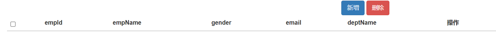


前端页面代码

```jsp
<%--
  User: wheat
  Date: 2022/4/25
  Time: 21:29
--%>
<%--jsp头文件配置信息。--%>
<%@ page contentType="text/html;charset=UTF-8" language="java" %>
<%@taglib uri="http://java.sun.com/jsp/jstl/core" prefix="c" %>
<!DOCTYPE html PUBLIC "-//W3C//DTD HTML 4.01 Transitional//EN" "http://www.w3.org/TR/html4/loose.dtd">
<html>
<head>
    <meta http-equiv="Content-Type" content="text/html; charset=UTF-8">
    <title>员工列表</title>
    <%--利用jsp的pagecontext作用域，定位工程路径 --%>
    <%
     pageContext.setAttribute("APP_PATH",request.getContextPath());
    %>
    <!-- web路径：
    不以/开始的相对路径，找资源，以当前资源的路径为基准，经常容易出问题。
    以/开始的相对路径，找资源，以服务器的路径为标准；需要加上项目名
     -->
    <!--引用jQuery -->
    <script type="text/javascript"
            src="${APP_PATH }/static/js/jquery-1.12.4.min.js"></script>
    <!--css框架 bootstrap -->
    <link
            href="${APP_PATH }/static/bootstrap-3.3.7-dist/css/bootstrap.min.css"
            rel="stylesheet">
    <script
            src="${APP_PATH }/static/bootstrap-3.3.7-dist/js/bootstrap.min.js"></script>
</head>
<body>
<!-- 员工修改的模态框 -->
<div class="modal fade" id="empUpdateModal" tabindex="-1" role="dialog" aria-labelledby="myModalLabel">
    <div class="modal-dialog" role="document">
        <div class="modal-content">
            <div class="modal-header">
                <button type="button" class="close" data-dismiss="modal" aria-label="Close"><span aria-hidden="true">&times;</span>
                </button>
                <h4 class="modal-title">员工修改</h4>
            </div>
            <div class="modal-body">
                <form class="form-horizontal">
                    <div class="form-group">
                        <label class="col-sm-2 control-label">empName</label>
                        <div class="col-sm-10">
                            <p class="form-control-static" id="empName_update_static"></p>
                        </div>

                    </div>
                    <div class="form-group">
                        <label class="col-sm-2 control-label">email</label>
                        <div class="col-sm-10">
                            <input type="text" name="email" class="form-control" id="email_update_input"
                                   placeholder="email@atguigu.com">
                            <span class="help-block"></span>
                        </div>
                    </div>
                    <div class="form-group">
                        <label class="col-sm-2 control-label">gender</label>
                        <div class="col-sm-10">
                            <label class="radio-inline">
                                <input type="radio" name="gender" id="gender1_update_input" value="M" checked="checked">
                                男
                            </label>
                            <label class="radio-inline">
                                <input type="radio" name="gender" id="gender2_update_input" value="F"> 女
                            </label>
                        </div>
                    </div>
                    <div class="form-group">
                        <label class="col-sm-2 control-label">deptName</label>
                        <div class="col-sm-4">
                            <!-- 部门提交部门id即可 -->
                            <select class="form-control" name="dId">
                            </select>
                        </div>
                    </div>
                </form>
            </div>
            <div class="modal-footer">
                <button type="button" class="btn btn-default" data-dismiss="modal">关闭</button>
                <button type="button" class="btn btn-primary" id="emp_update_btn">更新</button>
            </div>
        </div>
    </div>
</div>


<!-- 员工添加的模态框 -->
<div class="modal fade" id="empAddModal" tabindex="-1" role="dialog" aria-labelledby="myModalLabel">
    <div class="modal-dialog" role="document">
        <div class="modal-content">
            <div class="modal-header">
                <button type="button" class="close" data-dismiss="modal" aria-label="Close"><span aria-hidden="true">&times;</span>
                </button>
                <h4 class="modal-title" id="myModalLabel">员工添加</h4>
            </div>
            <div class="modal-body">
                <form class="form-horizontal">
                    <div class="form-group">
                        <label class="col-sm-2 control-label">empName</label>
                        <div class="col-sm-10">
                            <input type="text" name="empName" class="form-control" id="empName_add_input"
                                   placeholder="empName">
                            <span class="help-block"></span>
                        </div>
                    </div>
                    <div class="form-group">
                        <label class="col-sm-2 control-label">email</label>
                        <div class="col-sm-10">
                            <input type="text" name="email" class="form-control" id="email_add_input"
                                   placeholder="email@qq.com">
                            <span class="help-block"></span>
                        </div>
                    </div>
                    <div class="form-group">
                        <label class="col-sm-2 control-label">gender</label>
                        <div class="col-sm-10">
                            <label class="radio-inline">
                                <input type="radio" name="gender" id="gender1_add_input" value="M" checked="checked"> 男
                            </label>
                            <label class="radio-inline">
                                <input type="radio" name="gender" id="gender2_add_input" value="F"> 女
                            </label>
                        </div>
                    </div>
                    <div class="form-group">
                        <label class="col-sm-2 control-label">deptName</label>
                        <div class="col-sm-4">
                            <!-- 部门提交部门id即可 -->
                            <select class="form-control" name="dId">
                            </select>
                        </div>
                    </div>
                </form>
            </div>
            <div class="modal-footer">
                <button type="button" class="btn btn-default" data-dismiss="modal">关闭</button>
                <button type="button" class="btn btn-primary" id="emp_save_btn">保存</button>
            </div>
        </div>
    </div>
</div>


<!-- 搭建显示页面 -->
<div class="container">
    <!-- 标题 -->
    <div class="row">
        <div class="col-md-12">
            <h1>员工信息管理</h1>
        </div>
    </div>
    <!-- 按钮 -->
    <div class="row">
        <div class="col-md-4 col-md-offset-8">
            <button class="btn btn-primary" id="emp_add_modal_btn">新增</button>
            <button class="btn btn-danger" id="emp_delete_all_btn">删除</button>
        </div>
    </div>
    <!-- 显示表格数据 -->
    <div class="row">
        <div class="col-md-12">
            <table class="table table-hover" id="emps_table">
                <thead>
                <tr>
                    <th>
                        <input type="checkbox" id="check_all"/>
                    </th>
                    <th>empId</th>
                    <th>empName</th>
                    <th>gender</th>
                    <th>email</th>
                    <th>deptName</th>
                    <th>操作</th>
                </tr>
                </thead>
                <tbody>

                </tbody>
            </table>
        </div>
    </div>

    <!-- 显示分页信息 -->
    <div class="row">
        <!--分页文字信息  -->
        <div class="col-md-6" id="page_info_area"></div>
        <!-- 分页条信息 -->
        <div class="col-md-6" id="page_nav_area">

        </div>
    </div>

</div>
    

</body>
</html>

```

JavaScript部分

```javascript

    var totalRecord, currentPage;
    //1、页面加载完成以后，直接去发送ajax请求,要到分页数据
    $(function () {
        //去首页
        to_page(1);
    });

    function to_page(pn) {
        $.ajax({
            url: "${APP_PATH}/emps",
            data: "pn=" + pn,
            type: "GET",
            success: function (result) {
                //console.log(result);
                //1、解析并显示员工数据
                build_emps_table(result);
                //2、解析并显示分页信息
                build_page_info(result);
                //3、解析显示分页条数据
                build_page_nav(result);
            }
        });
    }

    function build_emps_table(result) {
        //清空table表格
        $("#emps_table tbody").empty();
        var emps = result.extend.pageInfo.list;
        $.each(emps, function (index, item) {
            var checkBoxTd = $("<td><input type='checkbox' class='check_item'/></td>");
            var empIdTd = $("<td></td>").append(item.empId);
            var empNameTd = $("<td></td>").append(item.empName);
            var genderTd = $("<td></td>").append(item.gender == 'M' ? "男" : "女");
            var emailTd = $("<td></td>").append(item.email);
            var deptNameTd = $("<td></td>").append(item.department.deptName);
            var editBtn = $("<button></button>").addClass("btn btn-primary btn-sm edit_btn")
                .append($("<span></span>").addClass("glyphicon glyphicon-pencil")).append("编辑");
            //为编辑按钮添加一个自定义的属性，来表示当前员工id
            editBtn.attr("edit-id", item.empId);
            var delBtn = $("<button></button>").addClass("btn btn-danger btn-sm delete_btn")
                .append($("<span></span>").addClass("glyphicon glyphicon-trash")).append("删除");
            //为删除按钮添加一个自定义的属性来表示当前删除的员工id
            delBtn.attr("del-id", item.empId);
            var btnTd = $("<td></td>").append(editBtn).append(" ").append(delBtn);
            //var delBtn =
            //append方法执行完成以后还是返回原来的元素
            $("<tr></tr>").append(checkBoxTd)
                .append(empIdTd)
                .append(empNameTd)
                .append(genderTd)
                .append(emailTd)
                .append(deptNameTd)
                .append(btnTd)
                .appendTo("#emps_table tbody");
        });
    }

    //解析显示分页信息
    function build_page_info(result) {
        $("#page_info_area").empty();
        $("#page_info_area").append("当前" + result.extend.pageInfo.pageNum + "页,总" +
            result.extend.pageInfo.pages + "页,总" +
            result.extend.pageInfo.total + "条记录");
        totalRecord = result.extend.pageInfo.total;
        currentPage = result.extend.pageInfo.pageNum;
    }

    //解析显示分页条，点击分页要能去下一页....
    function build_page_nav(result) {
        //page_nav_area
        $("#page_nav_area").empty();
        var ul = $("<ul></ul>").addClass("pagination");

        //构建元素
        var firstPageLi = $("<li></li>").append($("<a></a>").append("首页").attr("href", "#"));
        var prePageLi = $("<li></li>").append($("<a></a>").append("&laquo;"));
        if (result.extend.pageInfo.hasPreviousPage == false) {
            firstPageLi.addClass("disabled");
            prePageLi.addClass("disabled");
        } else {
            //为元素添加点击翻页的事件
            firstPageLi.click(function () {
                to_page(1);
            });
            prePageLi.click(function () {
                to_page(result.extend.pageInfo.pageNum - 1);
            });
        }

        
        var nextPageLi = $("<li></li>").append($("<a></a>").append("&raquo;"));
        var lastPageLi = $("<li></li>").append($("<a></a>").append("末页").attr("href", "#"));
        if (result.extend.pageInfo.hasNextPage == false) {
            nextPageLi.addClass("disabled");
            lastPageLi.addClass("disabled");
        } else {
            nextPageLi.click(function () {
                to_page(result.extend.pageInfo.pageNum + 1);
            });
            lastPageLi.click(function () {
                to_page(result.extend.pageInfo.pages);
            });
        }


        //添加首页和前一页 的提示
        ul.append(firstPageLi).append(prePageLi);
        //1,2，3遍历给ul中添加页码提示
        $.each(result.extend.pageInfo.navigatepageNums, function (index, item) {

            var numLi = $("<li></li>").append($("<a></a>").append(item));
            if (result.extend.pageInfo.pageNum == item) {
                numLi.addClass("active");
            }
            numLi.click(function () {
                to_page(item);
            });
            ul.append(numLi);
        });
        //添加下一页和末页 的提示
        ul.append(nextPageLi).append(lastPageLi);

        //把ul加入到nav
        var navEle = $("<nav></nav>").append(ul);
        navEle.appendTo("#page_nav_area");
    }

    //清空表单样式及内容
    function reset_form(ele) {
        $(ele)[0].reset();
        //清空表单样式
        $(ele).find("*").removeClass("has-error has-success");
        $(ele).find(".help-block").text("");
    }

    //点击新增按钮弹出模态框。
    $("#emp_add_modal_btn").click(function () {
        //清除表单数据（表单完整重置（表单的数据，表单的样式））
        reset_form("#empAddModal form");
        //s$("")[0].reset();
        //发送ajax请求，查出部门信息，显示在下拉列表中
        getDepts("#empAddModal select");
        //弹出模态框
        $("#empAddModal").modal({
            backdrop: "static"
        });
    });

    //查出所有的部门信息并显示在下拉列表中
    function getDepts(ele) {
        //清空之前下拉列表的值
        $(ele).empty();
        $.ajax({
            url: "${APP_PATH}/depts",
            type: "GET",
            success: function (result) {
                $.each(result.extend.depts, function () {
                    var optionEle = $("<option></option>").append(this.deptName).attr("value", this.deptId);
                    optionEle.appendTo(ele);
                });
            }
        });

    }

    //校验表单数据
    function validate_add_form() {
        //1、拿到要校验的数据，使用正则表达式
        var empName = $("#empName_add_input").val();
        var regName = /(^[a-zA-Z0-9_-]{6,16}$)|(^[\u2E80-\u9FFF]{2,5})/;
        if (!regName.test(empName)) {
            //alert("用户名可以是2-5位中文或者6-16位英文和数字的组合");
            show_validate_msg("#empName_add_input", "error", "用户名可以是2-5位中文或者6-16位英文和数字的组合");
            return false;
        } else {
            show_validate_msg("#empName_add_input", "success", "");
        }
        ;

        //2、校验邮箱信息
        var email = $("#email_add_input").val();
        var regEmail = /^([a-z0-9_\.-]+)@([\da-z\.-]+)\.([a-z\.]{2,6})$/;
        if (!regEmail.test(email)) {
            //alert("邮箱格式不正确");
            //应该清空这个元素之前的样式
            show_validate_msg("#email_add_input", "error", "邮箱格式不正确");
            /* $("#email_add_input").parent().addClass("has-error");
            $("#email_add_input").next("span").text("邮箱格式不正确"); */
            return false;
        } else {
            show_validate_msg("#email_add_input", "success", "");
        }
        return true;
    }

    //显示校验结果的提示信息
    function show_validate_msg(ele, status, msg) {
        //清除当前元素的校验状态
        $(ele).parent().removeClass("has-success has-error");
        $(ele).next("span").text("");
        if ("success" == status) {
            $(ele).parent().addClass("has-success");
            $(ele).next("span").text(msg);
        } else if ("error" == status) {
            $(ele).parent().addClass("has-error");
            $(ele).next("span").text(msg);
        }
    }

    //校验用户名是否可用
    $("#empName_add_input").change(function () {
        //发送ajax请求校验用户名是否可用
        var empName = this.value;
        $.ajax({
            url: "${APP_PATH}/checkuser",
            data: "empName=" + empName,
            type: "POST",
            success: function (result) {
                if (result.code == 100) {
                    show_validate_msg("#empName_add_input", "success", "用户名可用");
                    $("#emp_save_btn").attr("ajax-va", "success");
                } else {
                    show_validate_msg("#empName_add_input", "error", result.extend.va_msg);
                    $("#emp_save_btn").attr("ajax-va", "error");
                }
            }
        });
    });

    //点击保存，保存员工。
    $("#emp_save_btn").click(function () {
        //1、模态框中填写的表单数据提交给服务器进行保存
        //1、先对要提交给服务器的数据进行校验
        // if (!validate_add_form()) {
        //     return false;
        // }

        //1、判断之前的ajax用户名校验是否成功。如果成功。
        if ($(this).attr("ajax-va") == "error") {
            return false;
        }

        //2、发送ajax请求保存员工
        $.ajax({
            url: "${APP_PATH}/emp",
            type: "POST",
            data: $("#empAddModal form").serialize(),
            success: function (result) {
                //alert(result.msg);
                if (result.code == 100) {
                    //员工保存成功；
                    //1、关闭模态框
                    $("#empAddModal").modal('hide');

                    //2、来到最后一页，显示刚才保存的数据
                    //发送ajax请求显示最后一页数据即可
                    to_page(totalRecord);
                } else {
                    //显示失败信息
                    //console.log(result);
                    //有哪个字段的错误信息就显示哪个字段的；
                    if (undefined != result.extend.errorFields.email) {
                        //显示邮箱错误信息
                        show_validate_msg("#email_add_input", "error", result.extend.errorFields.email);
                    }
                    if (undefined != result.extend.errorFields.empName) {
                        //显示员工名字的错误信息
                        show_validate_msg("#empName_add_input", "error", result.extend.errorFields.empName);
                    }
                }
            }
        });
    });

    //1、我们是按钮创建之前就绑定了click，所以绑定不上。
    //1）、可以在创建按钮的时候绑定。    2）、绑定点击.live()
    //jquery新版没有live，使用on进行替代
    $(document).on("click", ".edit_btn", function () {
        //alert("edit");


        //1、查出部门信息，并显示部门列表
        getDepts("#empUpdateModal select");
        //2、查出员工信息，显示员工信息
        getEmp($(this).attr("edit-id"));

        //3、把员工的id传递给模态框的更新按钮
        $("#emp_update_btn").attr("edit-id", $(this).attr("edit-id"));
        $("#empUpdateModal").modal({
            backdrop: "static"
        });
    });

    function getEmp(id) {
        $.ajax({
            url: "${APP_PATH}/emp/" + id,
            type: "GET",
            success: function (result) {
                //console.log(result);
                var empData = result.extend.emp;
                $("#empName_update_static").text(empData.empName);
                $("#email_update_input").val(empData.email);
                $("#empUpdateModal input[name=gender]").val([empData.gender]);
                $("#empUpdateModal select").val([empData.dId]);
            }
        });
    }

    //点击更新，更新员工信息
    $("#emp_update_btn").click(function () {
        //验证邮箱是否合法
        //1、校验邮箱信息
        var email = $("#email_update_input").val();
        var regEmail = /^([a-z0-9_\.-]+)@([\da-z\.-]+)\.([a-z\.]{2,6})$/;
        if (!regEmail.test(email)) {
            show_validate_msg("#email_update_input", "error", "邮箱格式不正确");
            return false;
        } else {
            show_validate_msg("#email_update_input", "success", "");
        }

        //2、发送ajax请求保存更新的员工数据
        $.ajax({
            url: "${APP_PATH}/emp/" + $(this).attr("edit-id"),
            type: "PUT",
            data: $("#empUpdateModal form").serialize(),
            success: function (result) {
                //alert(result.msg);
                //1、关闭对话框
                $("#empUpdateModal").modal("hide");
                //2、回到本页面
                to_page(currentPage);
            }
        });
    });

    //单个删除
    $(document).on("click", ".delete_btn", function () {
        //1、弹出是否确认删除对话框
        var empName = $(this).parents("tr").find("td:eq(2)").text();
        var empId = $(this).attr("del-id");
        //alert($(this).parents("tr").find("td:eq(1)").text());
        if (confirm("确认删除【" + empName + "】吗？")) {
            //确认，发送ajax请求删除即可
            $.ajax({
                url: "${APP_PATH}/emp/" + empId,
                type: "DELETE",
                success: function (result) {
                    alert(result.msg);
                    //回到本页
                    to_page(currentPage);
                }
            });
        }
    });

    //完成全选/全不选功能
    $("#check_all").click(function () {
        //attr获取checked是undefined;
        //我们这些dom原生的属性；attr获取自定义属性的值；
        //prop修改和读取dom原生属性的值
        $(".check_item").prop("checked", $(this).prop("checked"));
    });

    //check_item
    $(document).on("click", ".check_item", function () {
        //判断当前选择中的元素是否5个
        var flag = $(".check_item:checked").length == $(".check_item").length;
        $("#check_all").prop("checked", flag);
    });

    //点击全部删除，就批量删除
    $("#emp_delete_all_btn").click(function () {
        //
        var empNames = "";
        var del_idstr = "";
        $.each($(".check_item:checked"), function () {
            //this
            empNames += $(this).parents("tr").find("td:eq(2)").text() + ",";
            //组装员工id字符串
            del_idstr += $(this).parents("tr").find("td:eq(1)").text() + "-";
        });
        //去除empNames多余的,
        empNames = empNames.substring(0, empNames.length - 1);
        //去除删除的id多余的-
        del_idstr = del_idstr.substring(0, del_idstr.length - 1);
        if (confirm("确认删除【" + empNames + "】吗？")) {
            //发送ajax请求删除
            $.ajax({
                url: "${APP_PATH}/emp/" + del_idstr,
                type: "DELETE",
                success: function (result) {
                    alert(result.msg);
                    //回到当前页面
                    to_page(currentPage);
                }
            });
        }
    });

```


使用到了Ajax和jQuery进行前端开发，基础模块使用html进行编写。


# 致谢

风吹雨成花，时间追不上白马。

如《时间煮雨》中所描述，终究还是要来的，短短几载，历经雨雪，经历了年关的新冠、经历了夏雨涛涛，大珠小珠落玉盘，在离别之际，回忆这几个春秋，恍惚间，想起超市买的雪糕与门口小贩买的烤串。

多年以后，面对眼前的屏幕，是否会回想起那个在操场跑步的遥远的夜晚？

将记忆向前排列，得到种种反应，产生了多种奇妙的景象印入脑海中，有上课快迟到，而跑楼梯的景象，有食堂饭太难吃太贵时候的生闷气的时候。

如果没有校园的这种环境，这些景象，再遇到的时候，可能是另一种截然不同的心境，是那种样子，现在还未曾可知。如果没有校园的这种环境，是否就再不会有这般回忆，那种可以不计较个人利益而选择交往的关系。

在校园内度过迷惘、欣喜与诸多感伤，在面临步入社会这临门一脚，充满许多怀念，原来时间是如此匆匆，在步入社会这步时，少年，你会改变成为什么样子呢？

在此，学生告谢老师们的诸多教导，IT迭代变化快，许多技能都需要自行去摸索，常言道：“师傅领进门，修行靠个人”。

有梦为马，乘着还年轻，乘着还可以去在当下适合的年纪，去拥抱这些梦幻般的琉璃。每个人在一定的年龄下会做与当下年纪行为相仿的事情。

>  路漫漫其修远兮，吾将上下而求索。   《离骚》


# 参考文献

[^1] 布鲁克斯(FrederickP.Brooks.Jr.).人月神话 .北京.清华大学出版社.2002.11

[2]CentOS-announce Release for CentOS Linux 8 and CentOS Streams.CentOS官网[引用日期2021-03-28]

[3]百度百科JavaEE https://baike.baidu.com/item/JavaEE

[4]百度百科 *mysql, http://baike.baidu.com/view/24816.htm*

[^5] 百度百科 Tomcat，https://baike.baidu.com/item/tomcat

[6]Linux防火墙脚本化管理研究  ．万方．2019[引用日期2019-08-04]

[7]任永昌编著．软件项目管理：清华大学出版社，2012.07

[8]刘振洪、吴敏凤．Linux操作系统实用教程．天津：天津科学技术出版社，2016：4-20

[9]开源社区网[引用日期2012-08-18]

[10]百度百科Java，https://baike.baidu.com/item/java/85979

[11]百度百科SSM框架，https://baike.baidu.com/item/SSM/18801167#ref

[12]王磊, 孙帆, 陈旭东. RESTFUL、SOAP、ICAP在移动网络中的应用[J]. 邮电设计技术, 2015, (9):35-38  

